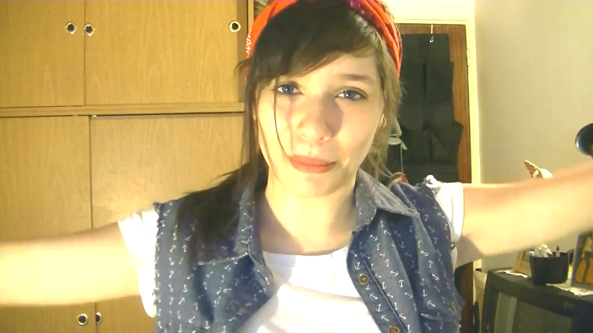
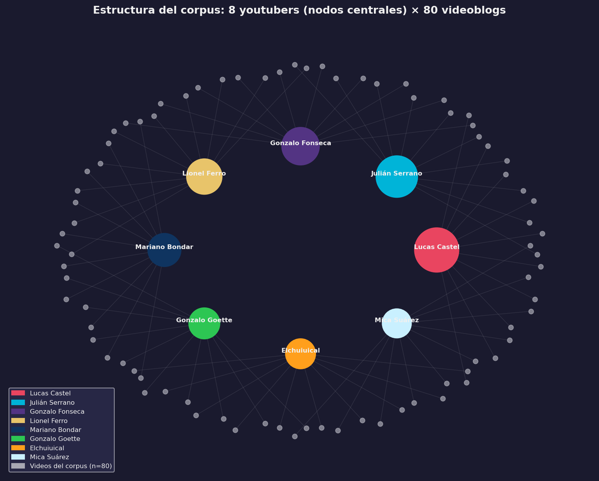
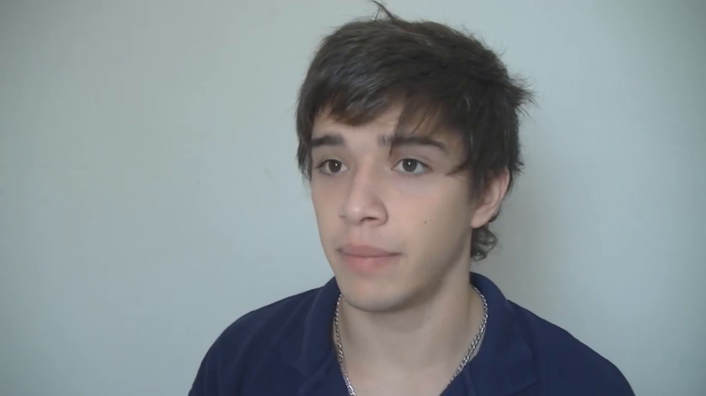

# Introducción

## El videoblog como espacio social practicado

YouTube nació en 2005 y fue adquirido por Google un año después. Desde entonces, con una velocidad que resultó difícil de anticipar, se convirtió en algo más que una plataforma de videos: fue el escenario donde millones de jóvenes latinoamericanos encontraron una forma propia de hablar, de mostrarse y de construir comunidad. Este trabajo nació, precisamente, de la observación de ese fenómeno.

Entre 2012 y 2016, youtubers argentinos como Lucas Castel, Julián Serrano y Mica Suárez acumularon millones de suscriptores haciendo, en apariencia, algo sencillo: grabarse a sí mismos en su habitación y contar cosas. Lo que esos videos revelaban, sin embargo, era bastante más complejo: estrategias discursivas elaboradas, negociaciones identitarias sofisticadas y nuevas formas de vinculación con la audiencia.

{#fig-setup-dormitorio fig-align="center" width="85%"}

::: {.content-visible when-format="html"}
[▶ Ver este momento en YouTube](https://youtu.be/K2T0inAUkDY?si=zv0GWD7rN3V1S2dG&t=257){target="_blank"}
:::

El videoblog, en tanto género ciberdiscursivo, emerge en la intersección entre las posibilidades técnicas de las plataformas digitales y ciertas necesidades expresivas propias de algunos sectores juveniles contemporáneos. A diferencia de lo que una mirada superficial podría sugerir, no se trata de adolescentes improvisando frente a una cámara. Los vlogs son textos multimodales complejos donde convergen la lógica algorítmica de la plataforma, las demandas de autenticidad de las audiencias y las tensiones entre lo local y lo global que atraviesan la experiencia juvenil en el capitalismo tardío.

Esta investigación doctoral aborda el videoblog desde la perspectiva del Análisis del Discurso Digital, entendiendo que estos productos culturales constituyen  [@mayansiplanells2002] donde las identidades juveniles no solo se expresan, sino que fundamentalmente se construyen, se negocian y se transforman. La noción de "espacio practicado" de @certeau1984, reelaborada para el contexto digital, permite comprender el vlog no como un simple formato audiovisual, sino como un territorio simbólico donde los jóvenes ejercen agencia cultural, desarrollan  y articulan narrativas identitarias que desafían las representaciones adultocéntricas más tradicionales.

El interrogante que orienta esta investigación puede formularse así: ¿De qué manera las identidades juveniles se discursivizan en los videoblogs de YouTube y qué características adquiere ese proceso en el contexto argentino del período 2012-2016?

De esa pregunta central se desprenden otras más específicas que han guiado el análisis a lo largo del trabajo. ¿Qué rasgos definen al videoblog como forma de  y cómo se relacionan esos rasgos con las necesidades comunicativas de quienes los producen? ¿Cómo se construyen y negocian las identidades digitales juveniles a través de las estrategias discursivas multimodales que despliegan los vlogs? ¿Qué trayectorias identitarias pueden identificarse en la evolución temporal de estos canales y cómo dialogan con las transformaciones del campo digital argentino? Y, finalmente, ¿qué prácticas sociolingüísticas caracterizan al videoblog y cómo se resuelve, en él, la tensión entre autenticidad local y proyección transnacional?

{#fig-corpus-network fig-align="center" width="95%"}

::: {.content-visible when-format="html"}
::: {.callout-note collapse="true" icon="false"}
## 📊 Código fuente de esta visualización
Esta figura fue generada con el script [`viz_all.py`](scripts/viz_all.py).
Los datos provienen de `MATRIZ_FINAL_RESTAURADA.csv` (corpus: 80 videoblogs).
:::
:::

{#fig-cara-corpus fig-align="center" width="85%"}

::: {.content-visible when-format="html"}
[▶ Ver video original en YouTube](https://www.youtube.com/watch?v=0bMeK79RCTM){target="_blank"}
:::

## Objetivos

El objetivo general de esta investigación es analizar las formas de construcción discursiva de narrativas identitarias juveniles en los videoblogs argentinos de YouTube durante el período 2012-2016, caracterizando las estrategias multimodales empleadas y las comunidades de práctica configuradas en torno a este género ciberdiscursivo.

Para alcanzarlo, la investigación se propone cinco objetivos específicos, que dan forma a la arquitectura analítica del trabajo: 

- caracterizar el videoblog como género ciberdiscursivo, identificando sus rasgos constitutivos, estructura textual y variaciones internas; 

- analizar los procesos de construcción identitaria juvenil, examinando las representaciones sociales movilizadas, las subjetividades construidas y las estrategias narrativas desplegadas; 

- desarrollar un sistema de índices ponderados para operacionalizar dimensiones clave como la , la glocalidad, la  y la autenticidad; 

- reconstruir las trayectorias identitarias de los youtubers a lo largo del período, analizando sus transformaciones temporales y

- examinar las prácticas sociolingüísticas específicas del género, identificando procesos de variación dialectal y emergencia de léxico especializado.

## Marco teórico-conceptual

Esta investigación se inscribe en la intersección de tres campos teóricos principales, que se articulan de manera productiva para abordar la complejidad del objeto de estudio.

El primero es el de los Estudios del Discurso [@arnoux2006; @fairclough2013; @dijk2009], extendido hacia las materialidades digitales a través del Análisis del Discurso Digital [@herring2015; @georgakopoulou2015]. El concepto central de  [@palazzo2010] permite comprender las especificidades de las prácticas discursivas juveniles en entornos digitales, caracterizadas por la , la interactividad y la construcción de identidades.

El segundo eje está constituido por los Estudios de Juventudes y Culturas Digitales. Adoptamos aquí una perspectiva sociocultural [@feixa2008; @garciacanclini2012; @reguillocruz2000] que entiende las juventudes no como categoría etaria, sino como construcción histórico-social. Los conceptos de culturas juveniles [@feixa2004] y el de espacio social practicado [@mayansiplanells2002] resultan fundamentales para comprender el videoblog como territorio simbólico de agencia juvenil.

El tercero articula las nociones de identidad como  [@giddens1991] con los desarrollos sobre  [@sibilia2008] y autenticidad en contextos digitales. La identidad digital no se entiende aquí como reflejo de una identidad "real" preexistente, sino como construcción discursiva situada que emerge en la intersección entre  tecnológicas, demandas de audiencia y búsquedas expresivas individuales.

## Hipótesis

La hipótesis principal de este trabajo puede formularse del siguiente modo: los nuevos medios en general, y los vlogs de YouTube en particular, conforman un espacio de práctica donde las identidades juveniles encuentran modos específicos para discursivizarse y adquirir una forma nueva de visibilización. Esas identidades se construyen como lo que denominamos montajes narrativos afectivos multimodales; se trata de formaciones discursivas en las que cuerpo, espacio, voz y edición se articulan deliberadamente. Su coherencia para la audiencia se sostiene sobre dos pilares: la  como condición estructural del género, y la  como tecnología relacional que convierte la apertura de la esfera íntima en moneda de cambio del vínculo con la audiencia.

De esa idea central se desprenden otras relacionadas. El videoblog es un espacio privilegiado para el montaje de narrativas de vida que representan identidades juveniles mediante construcciones discursivas complejas; en él el youtuber no solo muestra quién es, sino que a través de la práctica iterativa del género se va haciendo a sí mismo. Los jóvenes que practican estos espacios demuestran una  basada en su capacidad para leer algoritmos, modular la expresividad multimodal y gestionar la intimidad pública con una sofisticación que la mirada adulta frecuentemente subestima. Y, finalmente, estos géneros mantienen cierta estabilidad propia de los  al tiempo que se adaptan a las transformaciones impuestas tanto por la evolución tecnológica como por la interacción con los consumidores, lo que puede deberse a las motivaciones de perdurabilidad que tienen quienes producen y quienes consumen esos contenidos.

## Sobre la metodología

Esta investigación se inscribe en una perspectiva cualitativo-interpretativa que integra componentes cuantitativos, situándose en la intersección entre la tradición de la  [@kozinets2002] y los principios de la  [@glaser1967]. El diseño metodológico se fue articulando en diálogo constante con el corpus, con la teoría y con las herramientas disponibles en cada momento de la investigación.

El análisis discursivo multimodal de las producciones audiovisuales se complementó con una codificación sistemática instrumentada a través de una matriz analítica con más de 120 variables, con el desarrollo de índices ponderados para medir dimensiones identitarias clave y con un análisis de redes orientado a mapear las relaciones y comunidades de práctica relevantes a nuestro corpus. La visualización de datos se empleó, en este contexto, como herramienta heurística tanto como recurso ilustrativo.

La base empírica del estudio está constituida por un corpus de 80 videoblogs producidos durante el período 2012-2016 por ocho figuras del campo digital argentino: Lucas Castel, Julián Serrano, Mica Suárez, Gonzalo Fonseca, Gonzalo Goette, Lionel Ferro, Mariano Bondar y Elchuiuical. La conformación de esta muestra respondió a criterios estrictos: canales con más de un millón de suscriptores en el período, identificación explícita con el género vlogger y producción sostenida durante al menos dos años.

## Estructura de la tesis

El recorrido de esta investigación se organiza en tres grandes movimientos. La primera parte, titulada "Fundamentos", funciona como el andamiaje teórico y metodológico que sostiene todo el trabajo. Comienza con la presente introducción y avanza hacia el capítulo 2, donde se despliega el aparato conceptual. Allí, las herramientas de los Estudios del Discurso y los Estudios de Juventudes entran en diálogo con las teorías de la identidad digital y la noción de montaje semiótico. Una vez consolidado este marco, el capítulo 3 detalla el diseño metodológico de la investigación: desde la justificación del enfoque netnográfico y los criterios para la delimitación del corpus, hasta la configuración de la matriz y las estrategias precisas de análisis.

Le sigue la segunda parte, "Análisis y resultados", que constituye el corazón empírico de la tesis y propone una inmersión gradual en el fenómeno. Este tramo inicia con el capítulo 4, enfocado en caracterizar al videoblog como un género ciberdiscursivo con peso propio, desentrañando su estructura textual, sus variaciones internas, sus funciones comunicativas y los contextos que lo moldean. Sobre esta base, el capítulo 5 profundiza en la dimensión subjetiva: explora las identidades juveniles digitales, las representaciones sociales emergentes y las estrategias narrativas, apoyándose en la aplicación de un sistema de índices ponderados.

Posteriormente, el capítulo 6 amplía la mirada para reconstruir las trayectorias individuales de los ocho creadores de contenido que componen el corpus. En este espacio se analiza cómo se tejen sus redes de colaboración, la formación de sus comunidades de práctica y las dinámicas de transformación que atraviesan a lo largo del tiempo. Finalmente, el capítulo 7 aborda el tejido sociolingüístico de estas interacciones, poniendo el foco en la variación dialectal, la construcción de registros pragmáticos específicos y la emergencia de un léxico especializado.

Por último, la tercera parte, "Cierre", ofrece una síntesis integradora de todo el trayecto. En el capítulo 8 se presentan las conclusiones generales y los hallazgos más significativos, explicitando con claridad las condiciones de refutación de la hipótesis de partida. Este espacio final consolida los aportes teórico-metodológicos de la investigación, traza nuevas líneas y preguntas para futuros estudios y culmina con un epílogo reflexivo que invita a seguir pensando la complejidad de este escenario.

## Principales hallazgos

A modo de anticipación, este trabajo permitió definir el videoblog argentino como un género ciberdiscursivo con pautas estables —entre ellas, el saludo ritual, la despedida y una marcada hibridez textual— e identificar siete temas recurrentes vinculados a la construcción identitaria: lenguaje juvenil, subjetividad, amistad, tecnología, vida cotidiana, familia y humor. Los índices ponderados desarrollados para operacionalizar estas dimensiones muestran una relación estrecha entre cercanía parasocial y extimidad, y dan cuenta de un uso pragmático-discursivo orientado, en muchos casos, a neutralizar rasgos dialectales sin resignar del todo los marcadores de pertenencia local.

Conviene aclarar también lo que este estudio no hace. El análisis se concentra en las producciones discursivas de los youtubers —sus videos— y no incluye el estudio de la recepción ni de los comentarios de las audiencias, aunque ambas dimensiones constituirían líneas complementarias de trabajo futuro. Esta decisión no desconoce la importancia de las audiencias activas en la circulación de sentidos: @jenkins2013 han demostrado cómo los públicos participan activamente en la producción y resignificación de los contenidos mediáticos, y que la spreadability (esparcibilidad) de un contenido depende tanto de sus propiedades textuales como de las prácticas de apropiación de los usuarios.

Sin embargo, abordar rigurosamente la dimensión de la recepción, la cultura participativa o las comunidades interpretativas habría requerido un diseño metodológico diferente, centrado en el análisis de comentarios, encuestas a audiencias o etnografías digitales de comunidades de fans. En este trabajo, optamos deliberadamente por acotar el objeto al polo de la producción discursiva, priorizando una mayor profundidad analítica sobre las materialidades textuales y multimodales que constituyen la identidad del youtuber. Las dinámicas de recepción que @jenkins2013 y @boyd2014 han cartografiado de modo ejemplar quedan señaladas aquí como un horizonte necesario; un territorio fértil para futuras investigaciones que busquen tensionar estas configuraciones identitarias con las respuestas y reapropiaciones de sus comunidades en el ecosistema digital.

El período 2012-2016 fue seleccionado por representar el momento de consolidación del videoblog como género en Argentina, previo a las transformaciones introducidas por los cambios en las políticas de monetización de YouTube y la emergencia de plataformas como Instagram Stories o TikTok, que modificarían sustancialmente el ecosistema digital juvenil.

Los jóvenes youtubers estudiados no son meros reproductores de discursos hegemónicos ni víctimas pasivas de la mercantilización digital. Son agentes culturales que, con mayor o menor grado de reflexividad, construyen espacios de enunciación propios, negocian representaciones identitarias y articulan formas de sociabilidad que desafían las categorías analíticas más convencionales. Comprenderlos requirió desarrollar nuevas herramientas conceptuales y metodológicas: esa es, en síntesis, la apuesta de esta tesis.
