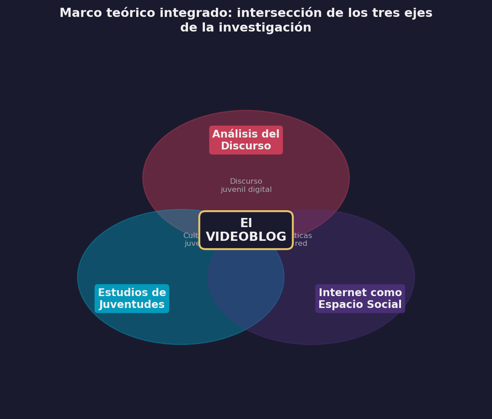
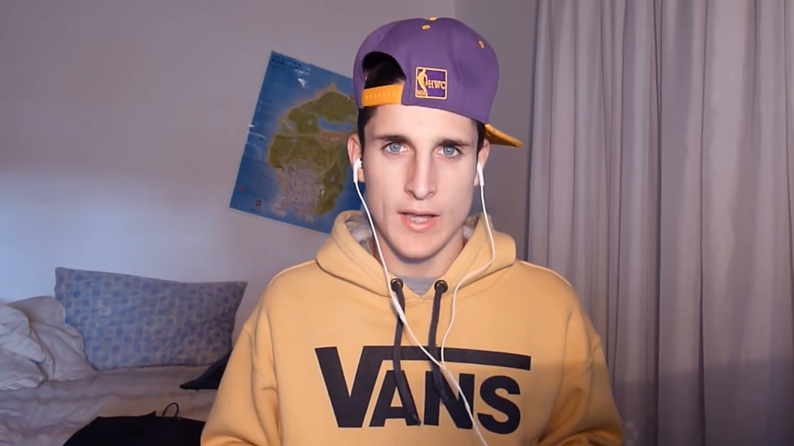

# Marco Teórico y Antecedentes

## Introducción

Construir un andamiaje conceptual para analizar fenómenos digitales impone una dificultad particular: los objetos de estudio cambian antes de que terminemos de definirlos. Esta investigación, circunscripta al período 2012-2016, adopta por eso un criterio de historicidad: para comprender cómo los jóvenes construían su identidad en ese lustro fundacional, es necesario reconstruir el horizonte de expectativas y las definiciones de género tal como eran concebidas en ese momento. Aplicar categorías posteriores correría el riesgo del anacronismo interpretativo. Organizo el recorrido en tres grandes ejes que, lejos de funcionar como compartimentos estancos, se intersectan para dar cuenta de la complejidad del objeto.

El eje central es el de los Estudios del Discurso. Retomo la tradición del Análisis Crítico y la lingüística textual [@arnoux2006; @fairclough2008; @vandijk2003; @charaudeau2006] para abordar el videoblog no como una novedad técnica, sino como una práctica social materializada en el lenguaje. Este eje se complementa con los desarrollos específicos del Análisis del Discurso Digital y la multimodalidad [@herring2015; @kress2001; @jewitt2009], fundamentales para un género donde la imagen, el sonido y la interfaz co-construyen el sentido junto a la palabra. En el ámbito local y regional, los aportes de @palazzo2010 y @palazzo2014 sobre el *ciberdiscurso juvenil* y de @cantamutto2016 sobre la interacción digital resultan insoslayables.

El segundo eje convoca a los Estudios en Juventudes. Para evitar esencialismos biológicos, adoptamos la perspectiva sociocultural que concibe a las juventudes como construcciones históricas y situadas. Son centrales aquí los trabajos de @feixa2008 y @feixa2013 sobre culturas juveniles y generaciones, así como las investigaciones latinoamericanas y nacionales que han mapeado las prácticas, consumos y territorialidades de los jóvenes en la región [@reguillo2000; @chaves2010; @margulis1996; @morduchowicz2012].

El tercero articula Internet como Espacio Social Practicado, noción que @mayansiplanells2002 desarrolla a partir de @certeau1984, con la categoría de extimidad de @sibilia2008, herramienta teórica clave para explicar la paradoja de la exhibición de la intimidad que caracteriza a las subjetividades contemporáneas en la red.

{#fig-venn-ejes fig-align="center" width="95%"}

::: {.content-visible when-format="html"}
::: {.callout-note collapse="true" icon="false"}
## 📊 Código fuente de esta visualización
Esta figura fue generada con el script [`viz_all.py`](scripts/viz_all.py).
Los datos provienen de `MATRIZ_FINAL_RESTAURADA.csv` (corpus: 80 videoblogs).
:::
:::

## Internet como espacio social practicado

Una primera parada ineludible en la revisión de la literatura son los estudios netnográficos, cuyo principal referente es @kozinets2002. Si bien su propuesta metodológica fue diseñada inicialmente para cartografiar comunidades de consumo y dinámicas de mercado, su verdadero aporte reside en la sistematización de la observación participante en entornos mediáticos. La netnografía ofrece un marco instrumental riguroso que consideramos adecuado para el abordaje de nuestro corpus, ya que permite capturar la cotidianeidad de las interacciones digitales.

Este enfoque se enriquece y adquiere una dimensión antropológica al entrar en diálogo con la etnografía de Internet [@mayansiplanells2002], que propone dejar de ver a la red como un mero canal de transmisión para entenderla como una densa trama de relaciones sociales. Bajo esta luz, el ciberespacio deja de ser una abstracción técnica y se revela como un "espacio social practicado", recuperando la distinción fundamental de @certeau1988: mientras el lugar es una configuración instantánea de posiciones, el espacio es el resultado de las operaciones que lo orientan, lo circunstancian y lo hacen funcionar. En nuestra investigación, esto implica que el entorno digital, pese a carecer de materialidad física, constituye una territorialidad simbólica que los sujetos habitan a través de tácticas discursivas. Es un escenario que se practica mediante el consumo y la producción de contenidos, se habita a través de la construcción de identidades y se disputa en la arena de los sentidos y las representaciones juveniles.

### *Internet linguistics*

Dentro de estos estudios, se incluyen los trabajos sobre lingüística en internet que abordan la Comunicación Mediada por Computadoras (CMC) como un fenómeno que requiere metodologías específicas [@crystal2002; @thurlow2009; @thurlow2004; @thurlow2011; @yus2010]. @betancourtarango2009 analiza el *ciberlenguaje* como variedad lingüística y sostiene que internet no simplemente desplaza la gramática estándar, sino que habilita una nueva, nacida de la creatividad de los usuarios y sus interacciones. En una línea complementaria, @giammatteo2012 aborda el lenguaje web en distintos niveles de análisis haciendo hincapié en el léxico. @parini2014 reúne en un volumen temático las ponencias de la Sociedad Argentina de Lingüística sobre lenguaje, discurso y espacios virtuales; y el propio @parini2009 presentó una investigación sobre los *fotologs* y la relevancia del contexto para la producción de sentidos en la web.

También importan los trabajos sobre lenguaje multimodal como marco de referencia, principalmente los de @kress1996; en esa misma línea, @androustsopoulos2003 analiza las construcciones discursivas de la identidad juvenil desde una perspectiva sociolingüística. A nivel local, @palazzo2014 y @palazzo2010 lideran los antecedentes sobre la relación entre lenguaje juvenil y nuevos medios a partir del concepto de *ciberdiscurso juvenil*, que atraviesa manifestaciones como el chat, el *fotolog* y el blog. Completan el campo los estudios sobre nuevos medios y convergencias [@igarza2008], sobre la Sociedad de la Información [@trejodelarbre2006] y sobre las generaciones de usuarios internautas [@piscitelli2009; @prensky2001].

## YouTube

### YouTube como objeto de estudio: cultura participativa y extimidad

La literatura académica ha abordado YouTube desde múltiples ángulos, convocados por la naturaleza híbrida de la plataforma. @burgess2009 y @burgess2011 definieron tempranamente a YouTube no como un repositorio de videos, sino como un sistema de "cultura participativa" donde coexisten las lógicas de los medios masivos con las prácticas de los usuarios amateurs. En este marco, la plataforma se configura como un archivo audiovisual dinámico y un sistema mediático singular [@snickars2009; @lovink2008].

@lange2007 destacó las tensiones entre lo público y lo privado que la plataforma inaugura, una línea que dialoga con la noción de “extimidad” propuesta por @sibilia2008 para describir la exhibición de la intimidad en los nuevos medios. @griffith2010, por su parte, ofrecieron una tipología temprana de usuarios distinguiendo entre quienes utilizan el medio con fines narrativos y aquellos con motivaciones más vinculadas a la autopromoción. A nivel regional y local, se destacan los aportes que vinculan a YouTube con las prácticas juveniles [@camposrodriguez2007; @reno2007; @chau2010; @murolo2015].

{#fig-extimidad-camara fig-align="center" width="85%"}

::: {.content-visible when-format="html"}
> [!NOTE]
> El video original de esta captura ("El peor rapero de la historia") ya no se encuentra disponible en YouTube debido al cierre del canal del autor a fines de 2025.
:::

### El videoblog como género discursivo emergente

El "videoblog" o "vlog" comparte raíz léxica con el "blog", pero su consolidación como género discursivo presenta especificidades que trascienden la mera transposición del diario escrito al formato audiovisual. @burgess2011 fue una de las primeras en caracterizarlo como un género nativo de la web, distinción que se enriquece con los aportes de @igarza2008 y @mier2009, quienes lo sitúan dentro del ecosistema mayor de las bitácoras digitales, pero con gramáticas propias.

La literatura ha abordado el vlog desde tres dimensiones complementarias. Como práctica cultural, investigaciones como las de @forain2008, @riveracruz2011 y @moreiramonterrosa2014 analizan el impacto del vlogging en la configuración de nuevas formas de expresión. Como construcción discursiva, trabajos previos [@karam2015; @masstorres2016; @depiero2013] han comenzado a delinear las estrategias retóricas y enunciativas que definen al género. Y como práctica estandarizada, la existencia de manuales para creadores [@lastufka2009; @acera2013; @esains2016] y las normativas de la propia plataforma [@google2012a; @google2012b; @google2013; @google2014] evidencian un proceso de institucionalización del género que fija reglas de producción y consumo.

Estudios tempranos como el de @bowman2004 ya habían aplicado la teoría dramatúrgica de @goffman1959 al análisis de estos videos, anticipando la relevancia de las nociones de "fachada" y "actuación" para comprender la performance de los vloggers, una línea que también exploraron @molyneaux2007a y @molyneaux2007b al analizar la identidad en la blogósfera audiovisual.

## Fundamentos lingüístico-textuales para el análisis del género

Para sistematizar el estudio del videoblog más allá de la descripción temática, esta investigación adopta la perspectiva de la lingüística del texto. Seguimos la propuesta de @heinemann1991, para quienes la tipología de géneros debe basarse en una clasificación multidimensional que contemple distintos niveles de representación prototípica: funcional, situacional y estructural. Esta mirada se articula con el concepto de "comunidad discursiva" de @swales1990. Según este autor, un género no existe en el vacío, sino que es poseído y utilizado por una comunidad que comparte objetivos públicos, mecanismos de intercomunicación y un léxico específico [@swales1990, pp. 24-27]. Desde otro ángulo, @bergmann1995 definen a los géneros como soluciones institucionalizadas a problemas comunicativos recurrentes. El vlog, en este sentido, puede leerse como la solución comunicativa que los jóvenes han encontrado —y estandarizado— para resolver el problema de la presentación y negociación de la identidad en el entorno digital.

## Juventudes

### Revisión de literatura

Los estudios sobre juventudes han cobrado gran relevancia en las últimas décadas, y es en ese campo donde insertamos esta investigación. La revisión podría volverse muy exhaustiva; nos limitamos aquí a los antecedentes más relevantes para la construcción de identidades juveniles en los nuevos medios.

A nivel internacional, los estudios de @buckingham2008 sobre prácticas discursivas de jóvenes en los nuevos medios son referencia ineludible. @raun2010 analiza, en un estudio sobre YouTube en los Estados Unidos, la presentación y el potencial transformativo de los videos para la configuración de identidades trans, un caso singular que ilumina la capacidad del género para alojar subjetividades diversas.

En España, @feixa2013, @feixa2009 y @feixa2008 poseen un vasto trabajo del que destacamos, sobre todo, los estudios sobre culturas juveniles, sobre las generaciones y sobre los procesos que él llama glocales. La obra de este investigador, junto con la del Instituto de la Juventud en España, ofrece un panorama de las perspectivas antropológicas y sociológicas sobre las juventudes. @rodriguez2002, por su parte, analiza y caracteriza las producciones juveniles desde el campo de la comunicación.

En América Latina, los trabajos de @garciacanclini2012 y su equipo en México sobre culturas juveniles urbanas y redes sociales, y la tesis doctoral de @silva2013 sobre jóvenes y consumos musicales en Brasil, forman parte del contexto regional de la investigación. La propuesta de @reguillocruz2000 sobre la emergencia de culturas juveniles y los aportes de @martinbarbero2002 sobre la relación entre jóvenes y nuevos medios son antecedentes próximos al tema.

En Argentina, cabe destacar el trabajo antropológico de @chaves2010 sobre la juventud desde las territorialidades y sus representaciones, los estudios de @morduchowicz2013 y @morduchowicz2012 sobre consumos culturales juveniles, y los estados de la cuestión elaborados bienalmente por la Red de Investigadores en Juventudes de Argentina (REIJA) desde 2012.

### Culturas juveniles

Para caracterizar la experiencia juvenil contemporánea, esta investigación se distancia de las definiciones biologicistas o etarias para adoptar la perspectiva sociocultural de las culturas juveniles. Siguiendo a @feixa2004, entendemos estas culturas como la expresión colectiva de experiencias sociales mediante estilos de vida distintivos, que en la actualidad se configuran crecientemente en torno al uso intensivo de tecnologías digitales y a la producción de metáforas de identificación grupal.

Dos propuestas teóricas resultan vertebrales en nuestra matriz de análisis. La primera es la tesis de @avello2002 sobre la "comunicación desamparada": los autores sostienen que la juventud actual habita una contradicción estructural entre mandatos opuestos —autonomía vs. dependencia, obediencia vs. autenticidad— y que, ante la crisis del discurso racional (*logos*), las culturas juveniles responden mediante una "estética de lo sensible" (*mythos*) que privilegia lo emocional, lo lúdico, la parodia y la centralidad del cuerpo como superficie de comunicación. Son rasgos que resultan claves para comprender la performance en el videoblog.

La segunda es la conceptualización de @bernete2007, quien describe a las juventudes del siglo XXI como sujetos que "habitan el entre". Para nosotros, esta noción resulta operativa para evitar binarismos simplificadores y pensar las identidades juveniles no como estados fijos, sino como negociaciones dinámicas en zonas de frontera: entre la cultura global y la local, entre la comunicación de masas y la comunicación en red, entre la reproducción del mundo adulto y la distinción generacional.

Estas categorías —los mandatos contradictorios, la estética de lo sensible, el espacio intersticial— no son meras descripciones teóricas: constituyen la base de la matriz analítica que se despliega en el capítulo de *Identidades*, donde se operacionalizan para examinar las tensiones específicas del corpus (autenticidad/performance, intimidad/espectáculo). Para abordar la dimensión digital de estas prácticas, asumimos además la distinción de @thurlow2004 entre identidad en línea e identidad digital, reconociendo que los medios interactivos han inaugurado una era de comunicación "hiperpersonal" donde la gestión de la intimidad se vuelve el eje de la sociabilidad entre pares.

## Herramientas analíticas: El discurso como práctica social

Para abordar la hipótesis de que los videoblogs constituyen espacios privilegiados de producción identitaria, esta investigación adopta la perspectiva interdisciplinaria del Análisis del Discurso. Siguiendo a @wodak2003 y @fairclough2008, no concebimos el discurso como un mero producto lingüístico, sino como una práctica social que simultáneamente representa y constituye el mundo, las identidades y las relaciones sociales. Desde este marco, conceptualizamos a los usuarios de YouTube como una comunidad discursiva [@arnoux2010] organizada en torno a la producción de géneros específicos y regulada por marcos institucionales concretos. El vlog se analiza, entonces, como un género discursivo históricamente situado [@fairclough2008] donde se negocian sistemas de creencias, relaciones de poder y representaciones sobre la realidad.

Para abordar estas formaciones discursivas sin clausurar sus sentidos [@maingueneau2006], el diseño metodológico adapta el procedimiento analítico de @arnoux2010: se parte del problema de la identidad, se relevan marcas discursivas que funcionan como indicios, y se opera mediante abducción hasta reconstruir las narrativas identitarias. La operativización del análisis se apoya en dos herramientas conceptuales clave. La noción de ethos de @charaudeau2006 permite desentrañar la construcción de la imagen de sí, distinguiendo entre el sujeto comunicante y el enunciador construido sobre el sostén de "imaginarios sociodiscursivos" compartidos con la comunidad. El concepto de ciberdiscurso juvenil de @palazzo2010 habilita leer rasgos como el registro coloquial, la parodia y la antinormatividad no como déficits, sino como formas de acción social orientadas a la eficacia comunicativa y la afirmación identitaria.

## Conceptos operativos

### Prácticas sociales, prácticas discursivas, discursos y textos

La teoría de las Representaciones Sociales ha recibido cuestionamientos —entre ellos, el de @potter1998— por su carácter principalmente cognitivo. Para anclar el análisis en la materialidad social, recurrimos a la articulación entre representaciones y prácticas discursivas. Siguiendo a @fairclough1998 y @fairclough2003, entendemos el discurso como una práctica que simultáneamente representa y constituye el mundo, las identidades y los sistemas de creencias, atravesada por condiciones materiales de producción, circulación y consumo. @zullo2015 propone abordar los discursos como partes constitutivas de las prácticas sociales, reconociendo su doble carácter de producto textual y proceso social; @haidar1992 destaca que la peculiaridad de los discursos como prácticas sociales reside en sus diferentes materialidades —lingüística, ideológica, comunicativo-pragmática—; y @cebrelli2005 los define como configuraciones discursivas cuya función es institucionalizada y sobre las cuales se sostienen la cultura y las subjetividades.

### Representaciones sociales y representaciones discursivas

El concepto de Representación Social (RS), definido inicialmente por @moscovici1979 como una modalidad de conocimiento particular cuya función es la elaboración de comportamientos y la comunicación, resulta basal para este estudio. Estas representaciones operan mediante dos procesos: la objetivación, que otorga textura material a nociones abstractas, y el anclaje, que integra lo nuevo en un sistema de conocimiento preexistente [@jodelet1986]. Siguiendo a @jodelet1984, las RS no son imágenes estáticas, sino herramientas epistémicas que permiten interpretar la realidad cotidiana y dotar de sentido a lo inesperado. Para un análisis centrado en textos digitales, resulta necesario el desplazamiento hacia la noción de Representación Discursiva (RD). Retomando a @raiter2002 y @raiter2010, entendemos que el lenguaje media y complejiza la relación entre los sujetos y sus representaciones; y adoptamos la definición de @montecinosoto2005 de las RD como las "imágenes-creencias" que los hablantes construyen lingüísticamente en contextos concretos mediante recursos léxicos, semánticos y sintácticos. Mientras la RS pertenece al orden de lo psicosocial, la RD es su materialización observable en el texto: leerlas como textos habilita la posibilidad de su análisis, interpretación y crítica ideológica [@remedi2004].

### Identidades y subjetividades: del proyecto reflexivo a la trama emocional

La noción de identidad ha transitado desde concepciones esencialistas hacia perspectivas dinámicas que privilegian los procesos de identificación y la historicidad de las construcciones sociales [@hall1996 @bauman2000 @arfuch2002]. Esta investigación adopta la conceptualización de identidad como proyecto reflexivo de @giddens1991: una narrativa biográfica que el individuo sostiene y revisa continuamente, integrando experiencias vitales en una trama coherente y gestionando el cuerpo como parte activa del sistema de acción. Esta visión resulta especialmente operativa para analizar el videoblog, género que funciona como una "tecnología del yo" [@foucault1990] donde la narración de la propia vida y la exhibición del cuerpo se vuelven la materia prima de la interacción.

A esta concepción narrativa de la identidad conviene añadir la dimensión performativa que @butler1990 formuló para el género, pero cuyo alcance teórico excede esa categoría: la identidad no es algo que se *tiene* ni algo que simplemente se *narra*, sino algo que se *hace* iterativamente. Butler sostiene que la identidad es "un efecto performativamente constituido" mediante la repetición ritualizada de actos corporal-discursivos dentro de marcos regulatorios [@butler1990, p. 25]. Trasladada al contexto del videoblog, esta perspectiva ilumina un aspecto que la noción giddensiana de proyecto reflexivo no captura del todo: el youtuber no solo construye una narrativa coherente de sí, sino que la *performa* periódicamente ante una audiencia que funciona como marco regulador. Cada video es un acto iterativo de producción de identidad —un "*doing*" más que un "*being*"— donde la repetición no reproduce mecánicamente un original, sino que lo produce retroactivamente [@butler2004]. La "autenticidad" del youtuber no es anterior a la performance videobloguera; emerge de ella.

Para captar la densidad de la experiencia juvenil contemporánea, la categoría de identidad requiere ser complementada y tensionada por la de subjetividad. Siguiendo a @bonvillani2009 y @bonvillani2014, entendemos la subjetividad como un "modo de ser y estar en el mundo" que articula sentidos subjetivos, emociones y prácticas sociales. Recuperando a Castoriadis y Bourdieu, @bonvillani2009 enfatiza que la subjetividad se construye en la tensión dialéctica entre las estructuras sociales (lo instituido) y la capacidad de agencia del sujeto (lo instituyente), y que la dimensión emocional cobra aquí un valor central: los "sentidos subjetivos" integran lo simbólico y lo afectivo, permitiendo comprender cómo los jóvenes no solo *piensan* su identidad, sino que la *sienten* y la comprometen pasionalmente [@bonvillani2013].

### La perspectiva narrativa: de la estructura a la construcción del yo

El análisis de las narrativas juveniles en el videoblog constituye un pilar fundamental de esta investigación, no solo por la predominancia de la secuencia narrativa en el género, sino por su función sociológica. Siguiendo a @franzosi1998, las narrativas no son meros artefactos lingüísticos, sino índices de la realidad social que revelan las relaciones entre los sujetos.

Para el abordaje de la estructura del relato, recuperamos el modelo clásico de @labov1967, @labov1997 y @labov2006. Si bien su esquema de orientación, complicación y resolución provee la base formal, nuestro interés se concentra en el concepto de narrabilidad (*tellability*): los criterios sociales y cognitivos que determinan qué eventos de la vida cotidiana merecen ser contados. Siguiendo a @norrick2005, en el videoblog esta narrabilidad se negocia en un doble límite: el umbral inferior del interés (evitar el aburrimiento) y el umbral superior de lo apropiado (gestionar la intimidad). Esta negociación es constitutiva del pacto de lectura con la audiencia.

Como nuestro objeto es la identidad, complementamos la visión estructural con la perspectiva constructivista de @bruner2004, para quien la autobiografía no refleja la vida vivida, sino que la constituye mediante la reinterpretación narrativa. En esta línea, la propuesta de @bamberg2012 sobre los espacios dilemáticos resulta particularmente operativa: las narrativas del vlog habitan tensiones permanentes entre la igualdad y la diferencia (pertenecer vs. distinguirse), entre el mundo y la persona (agencia vs. pasividad) y entre la permanencia y el cambio. Estos dilemas son las herramientas analíticas que permiten observar cómo los youtubers se posicionan identitariamente a través de sus relatos.

### La identidad como montaje: una operación semiótica

La noción de **montaje** articula y da nombre a la lógica profunda de la construcción identitaria en el videoblog. El término, sin embargo, requiere una desambiguación explícita dado que convoca al menos tres tradiciones teóricas que operan en escalas diferentes y que en esta tesis se articulan productivamente.

En su acepción **cinematográfica**, montaje refiere a la técnica de ensamblaje de planos y secuencias que produce sentido mediante la yuxtaposición temporal de imágenes —la tradición de Eisenstein y la "gramática" del cine. Los youtubers del corpus practican este montaje cuando editan sus videos: cortan, insertan música, sobreimprimen texto, modulan el ritmo. Este nivel es *técnico*: pertenece al ámbito de las decisiones de postproducción.

En su acepción **filosófica**, retomamos la tradición del *agencement* (ensamblaje o disposición en agencia) que @deleuzeguattari1987 proponen para pensar las configuraciones sociales: un montaje es una articulación contingente de elementos heterogéneos —cuerpo, espacio, tecnología, deseo, institución— que produce una entidad funcional irreducible a sus partes. Este nivel es *ontológico*: el youtuber no preexiste al montaje, sino que emerge de él.

En su acepción **semiótica**, que es la que organiza nuestro análisis, retomamos la semiótica social de @kress2009 y @kress2001 sobre el montaje como operación de articulación multimodal: la selección y combinación de recursos semióticos heterogéneos que produce sentidos nuevos irreducibles a cada componente aislado. En el vlog, el montaje no es solo una técnica de edición de video; es la operación constitutiva de la identidad misma. Cada video ensambla cuerpo, voz, espacio doméstico, música y símbolo en una configuración que el espectador lee como expresión de un "yo" coherente. Este yo es menos una esencia preexistente que el efecto de una articulación contingente de elementos: el youtuber deviene quien es en el acto mismo de montar el video.

Estas tres dimensiones no son excluyentes, sino concéntricas: el montaje técnico (edición) materializa opciones del montaje semiótico (articulación de recursos), que a su vez participa de la lógica del ensamblaje ontológico (producción del sujeto). Cuando sostenemos, como hipótesis central, que las identidades juveniles en YouTube son **montajes narrativos afectivos multimodales**, estamos operando simultáneamente en los tres niveles: las decisiones de corte producen efectos de sentido que producen efectos de identidad.

Esta perspectiva es compatible con la de @giddens1991 y la complementa: si para Giddens el yo es un proyecto reflexivo narrado, aquí añadimos que esa narración tiene una materialidad semiótica específica —el montaje audiovisual— que no es neutral, sino generadora de efectos de sentido. La competencia para construir ese montaje de modo que resulte creíble, atractivo y propio es precisamente lo que define al youtuber como agente identitario en la plataforma. Y es también lo que conecta con la perspectiva performativa de @butler1990: el montaje es el medio material a través del cual se itera la identidad, video a video, produciendo el efecto de un sujeto estable a partir de actos discretos y contingentes.

### Competencia cibercomunicativa: una propuesta conceptual

Para dar cuenta de la especificidad de estas prácticas, esta tesis propone el concepto de competencia cibercomunicativa. La categoría nace de la readecuación de la *competencia comunicativa* de @hymes1972 a las condiciones de producción, circulación y consumo de los nuevos medios. Si bien dialogamos con los avances en torno a la "competencia mediática" [@ferres2012], la propuesta se distancia de ese enfoque general para ganar en especificidad. La competencia cibercomunicativa no refiere a una alfabetización digital amplia, sino a la capacidad pragmática situada de los jóvenes para gestionar la interacción en plataformas: saber leer los algoritmos, modular la expresividad multimodal, gestionar la intimidad pública y sostener . Es un saber-hacer identitario y relacional que se despliega en las dimensiones expresiva e interactiva del entorno digital.

## Síntesis

El recorrido trazado en este capítulo ha construido un andamiaje conceptual para abordar la complejidad del videoblog como práctica social antes que como mero formato técnico. Articulamos la perspectiva sociocultural de las juventudes (Feixa, Reguillo) con el análisis discursivo de los entornos digitales (Fairclough, Palazzo), situando al vlog como un espacio social practicado donde la identidad se negocia en la tensión entre la narrativa reflexiva (Giddens), la iteración performativa (Butler) y la experiencia subjetiva (Bonvillani), dentro de un ecosistema cuyas condiciones de posibilidad están moldeadas por la lógica de la plataforma (van Dijck). La noción de montaje semiótico (Kress, Deleuze-Guattari), desambiguada en sus tres niveles —técnico, ontológico y semiótico—, atraviesa transversalmente este andamiaje: el youtuber no describe una identidad previa, la ensambla en cada video mediante la articulación de recursos heterogéneos.

La revisión de antecedentes revela que existen abundantes estudios sobre YouTube como plataforma y sobre las juventudes como categoría sociológica, pero persiste una vacancia significativa en el abordaje sistemático del videoblog como género identitario en el contexto argentino. La mayoría de las investigaciones previas han focalizado en el consumo, la recepción o los aspectos mercantiles, dejando en segundo plano el análisis de las materialidades discursivas mediante las cuales los jóvenes construyen y exhiben su yo. Las categorías aquí definidas —desde la extimidad hasta la competencia cibercomunicativa, pasando por la operación de montaje— funcionan como la caja de herramientas que habilita metodológicamente el análisis empírico de los capítulos siguientes.
