# Metodología

**El videoblog como objeto de estudio: decisiones, herramientas y caminos de la investigación**

## La web como campo, el vlog como objeto

Investigar con objetos provenientes de la web resulta complejo por una diversidad de factores, y el más importante, sin dudas, es la vertiginosidad con la que cambia el entorno de trabajo. La web no es un archivo estable: es un ecosistema en permanente transformación donde los contenidos aparecen, se modifican, migran de plataforma o desaparecen sin dejar rastro visible. Esta volatilidad, lejos de ser un obstáculo menor, constituye un desafío epistemológico y metodológico central para quienes trabajamos con discursos digitales.

::: {.callout-note appearance="minimal"}
**Nota sobre la persona gramatical.** A lo largo de esta tesis se emplea el plural académico ("nosotros"), coherente con la convención del campo disciplinar. Sin embargo, en este capítulo metodológico se adopta deliberadamente la primera persona del singular. La decisión responde a la naturaleza del relato: las decisiones de diseño, los errores cometidos en la recolección de datos, las idas y vueltas del proceso investigativo son experiencias situadas que resultan más honestas y transparentes narradas desde el "yo" que las vivió. Como señala @vasilachis2006, la reflexividad metodológica exige que el investigador se haga presente en el relato de sus decisiones.
:::

La primera recomendación para cualquiera que quiera realizar esta tarea es planificar cuanto antes una base de datos de partida con todos los elementos que considere necesarios, y buscar herramientas para almacenar esos datos, a riesgo de que se pierdan, cambien o "desaparezcan". Porque nada desaparece definitivamente en la web, pero rastrearlo se vuelve más complejo a medida que pasa el tiempo.

Esto ha sido un aprendizaje obtenido en la escritura de este trabajo: de los errores se aprende, y navegar sin un conocimiento claro de qué es lo que se quiere puede traer complicaciones, aunque también ayuda a obtener nuevas herramientas para rastrear el "pasado" de los sitios. Por ese motivo, considero que un apartado de metodología que no ahonde en los escollos de esta travesía sería, cuando menos, falaz. Lo que me propongo en este capítulo es ofrecer un panorama honesto de las idas y vueltas, de las tomas de decisiones y de las estrategias desplegadas que configuraron la metodología concreta de lo realizado.

Cuando comencé la investigación en el año 2010, no sabía bien adónde quería llegar. Tenía mi pregunta, tenía algunos conceptos clave que me permitirían avanzar y contaba con un marco metodológico general, pero no tenía aún las herramientas propias de este tipo de trabajo. Elegí YouTube por el fenómeno que me resultó atractivo y que consideraba que tenía un campo adecuado para el análisis. Los contenidos multimedia y multimodales que ofrecía permiten mirar aspectos diferentes a los de una foto o una entrada escrita; sin embargo, pronto me di cuenta de que, a pesar de resultar más nutritivo en términos de recursos semióticos, igualmente debía ir de la mano de los otros sitios web donde los youtubers construyen su identidad digital de manera distribuida.

## Posicionamiento epistemológico y metodológico

### Paradigma cualitativo-interpretativo

Esta investigación se inscribe en el paradigma cualitativo-interpretativo de las ciencias sociales [@vasilachis2006], que concibe la realidad social como construida intersubjetivamente mediante prácticas significantes. Desde esta perspectiva, el análisis no busca generalizar leyes universales, sino comprender los sentidos que los actores sociales —en este caso, jóvenes youtubers argentinos— construyen y negocian en sus prácticas discursivas situadas.

El diseño metodológico no fue lineal ni predeterminado: se fue ajustando en diálogo constante con el corpus, la teoría y las herramientas disponibles. Los fenómenos sociales son complejos, contextuales e históricamente situados, y su comprensión requiere metodologías flexibles, recursivas y sensibles a las especificidades del objeto de estudio.

### Enfoque netnográfico

La netnografía [@kozinets2010; @hine2015] es la adaptación de la etnografía tradicional al estudio de comunidades y culturas en entornos digitales. A diferencia de la etnografía clásica, que requiere la presencia física del investigador en el campo, la netnografía implica una observación situada en espacios virtuales. Para @kozinets2010, no se trata simplemente de "etnografía online", sino de un método que reconoce las particularidades de las culturas digitales: su carácter multimodal, su distribución en múltiples plataformas, la permanencia de todo en forma de datos y la posibilidad de acceder a grandes cantidades de material sin intervención directa del investigador. En nuestro caso, esto significó trabajar con un corpus de videoblogs públicamente disponibles en YouTube, sin necesidad de solicitar permisos específicos, pero con la responsabilidad ética de analizar esos materiales desde una perspectiva crítica y respetuosa.

@hine2015 sostiene que la etnografía digital debe ser adaptativa a cada entorno, multimodal en sus medios, reflexiva respecto a la labor investigadora y situada en contextos específicos. Estos principios orientaron el trabajo.

### Teoría fundada como horizonte epistemológico

La teoría fundada [@glaser1967; @strauss2002] propone que las categorías analíticas deben emerger inductivamente del análisis sistemático de los datos, antes que aplicarse deductivamente desde marcos teóricos previos. Si bien esta investigación no siguió estrictamente ese método —no hubo, por ejemplo, muestreo teórico progresivo—, sí adoptó su espíritu: partir del corpus para construir categorías, refinarlas mediante comparación constante y establecer relaciones entre ellas de manera fundamentada empíricamente. No todas las categorías se definieron de antemano; varias emergieron durante el análisis del corpus. El proceso fue recursivo: codificación, análisis, ajuste de categorías y recodificación según fuera necesario.

### Análisis crítico del discurso como marco analítico

El análisis crítico del discurso (ACD), según la propuesta de @fairclough1992 y @fairclough2003, concibe el discurso como práctica social que construye y es construida por estructuras sociales más amplias. Para Fairclough, el ACD debe explorar sistemáticamente las relaciones —a menudo opacas— de causalidad y determinación entre las prácticas discursivas, los eventos y los textos, por un lado, y las estructuras, procesos y relaciones sociales y culturales más amplios, por el otro [@fairclough2008, p. 174].

Esta perspectiva resulta especialmente productiva para el análisis de videoblogs juveniles porque permite articular tres niveles complementarios: el nivel textual, con las características y regularidades lingüísticas, multimodales y estructurales de los vlogs; el nivel de las prácticas discursivas, con los procesos de producción, distribución y consumo de vlogs en YouTube; y el nivel de las prácticas sociales, con las identidades juveniles, las culturas digitales y las relaciones de poder que atraviesan estas producciones. Lo que nos interesa destacar es la capacidad del discurso para constituir y ser constituido por estos tres elementos, que son centrales para nuestro análisis: cómo se inscriben y manifiestan los sujetos y sus identidades; cómo se expresan las relaciones de poder, las simetrías y asimetrías sociales; y cuáles son las representaciones que los sujetos construyen sobre la realidad.

## Diseño metodológico general

Esta investigación es exploratorio-descriptivo-interpretativa. Exploratoria, porque el videoblog ha sido poco estudiado en Argentina; descriptiva, por su análisis sistemático de propiedades discursivas, estructurales y multimodales; e interpretativa, porque indaga los sentidos identitarios negociados en los vlogs. El diseño es transversal —el corpus abarca 2012-2016— e incluye elementos diacrónicos al abordar videos de diferentes años de cada youtuber.

### Fases de la investigación

El proceso metodológico no fue lineal, sino espiralado y recursivo, con constantes idas y vueltas entre corpus, teoría y análisis. Como señala @karam2005, en todo Análisis del Discurso "se van realizando operaciones simultáneas: no es un continuum diacrónico que va del contexto al análisis o de la categorización a la aplicación del ejercicio analítico. Es un ir y volver —sístole y diástole— de las categorías explicativas al análisis en sí y luego nuevamente a esas categorías para revisar o ajustarlas" [@karam2005, p. 7].

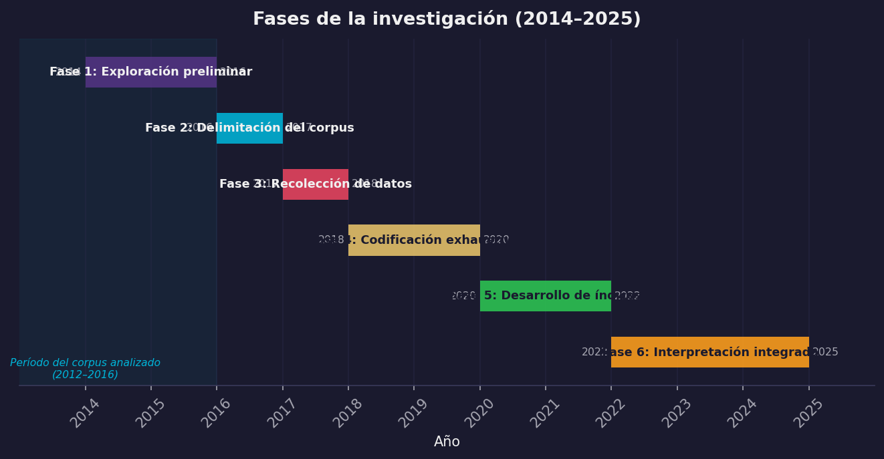{#fig-gantt-fases fig-align="center" width="95%"}

::: {.content-visible when-format="html"}
::: {.callout-note collapse="true" icon="false"}
## 📊 Código fuente de esta visualización
Generado con [`viz_all.py`](scripts/viz_all.py) desde los datos del corpus.
:::
:::

**Fase 1 (2014-2016): Trabajo exploratorio.** Durante mi tesina [@depiero2012] estudié el género videoblog analizando dos youtubers (uno argentino y uno inglés) y un corpus de 200 videos. De ese trabajo nació una definición operativa del videoblog [@depiero2014], las categorías de su  y las primeras intuiciones sobre sus funciones identitarias. Esta etapa fue clave para comprender el objeto antes de la tesis doctoral.

**Fase 2 (2016-2017): Delimitación del corpus.** Durante esta etapa se establecieron los criterios de selección del corpus doctoral: youtubers argentinos con más de un millón de suscriptores hasta diciembre de 2016, período de análisis de 2012 a 2016, género predominante el videoblog, diez videos por creador combinando los más vistos y los menos vistos de cada año. El corpus quedó conformado por 80 videoblogs pertenecientes a ocho youtubers: Lucas Castel, Julián Serrano, Gonzalo Fonseca, Lionel Ferro, Mariano Bondar, Gonzalo Goette, Elchuiuical y Mica Suárez.

**Fase 3 (2017-2018): Recolección de datos y construcción de la base.** Se descargaron todos los videos del corpus, se extrajeron metadatos mediante herramientas automatizadas y se transcribieron manualmente los 80 videos. Esta fase implicó un trabajo exhaustivo de sistematización que luego permitió el análisis en profundidad.

**Fase 4 (2018-2020): Codificación exhaustiva.** Se diseñó una matriz de codificación con más de 125 variables organizadas en dimensiones discursivas, multimodales, pragmáticas y temáticas. Cada video fue visto múltiples veces para completar todas las variables. Esta fase llevó casi un año e implicó refinamientos constantes del sistema de codificación.

**Fase 5 (2020-2022): Desarrollo de índices y análisis integrado.** A partir de la base de datos codificada, se realizaron análisis cuantitativos —frecuencias, correlaciones, índices ponderados— y cualitativos —análisis discursivo de fragmentos específicos—. Se generaron visualizaciones para identificar patrones y relaciones, y se validó el trabajo en congresos, seminarios y artículos.

**Fase 6 (2022-2025): Re-transcripción, refinamiento e interpretación final.** Con la disponibilidad de herramientas de inteligencia artificial, se utilizó Otter.ai para retranscribir los videos con marcas temporales precisas, revisando las transcripciones manuales iniciales y posibilitando análisis más finos, especialmente en el capítulo de variedades lingüísticas.

## Corpus de investigación

### Criterios de selección

La construcción del corpus implicó múltiples decisiones estratégicas orientadas a equilibrar representatividad, viabilidad y pertinencia teórica.

**El millón de suscriptores.** El primer criterio fue seleccionar youtubers con más de 1 millón de suscriptores a diciembre de 2016. Esta decisión se fundamenta en que YouTube otorga el "Botón de Oro" a los canales que alcanzan ese umbral, reconociéndolos como creadores relevantes dentro de la plataforma. Consideramos que la cantidad de suscriptores es un indicio pertinente para evaluar el impacto social de los youtubers y garantizar que analizamos producciones que circulan, son consumidas y generan comunidad. Para corroborar los datos, apelamos a la base de datos de Social Blade (https://socialblade.com), que registra la evolución histórica de estadísticas de canales de YouTube.

**El criterio geográfico: Argentina.** La delimitación del corpus a youtubers argentinos se inscribe en los proyectos PIUNT dirigidos por la Dra. Palazzo desde 2012. Esta restricción posibilita un examen detallado de las variedades lingüísticas regionales, las referencias culturales locales y las construcciones identitarias propias del contexto nacional. No se pretende, sin embargo, que los resultados sean aplicables únicamente a este territorio: las identidades juveniles se construyen en diálogo con contextos específicos, y esa particularidad es precisamente lo que se pone en análisis.

**El criterio temporal: 2012-2016.** El recorte comprende el período de consolidación de YouTube como plataforma de expresión juvenil en Argentina, cuando los youtubers pasaron de ser aficionados a convertirse en referentes reconocidos del ecosistema digital. Durante esos años se estabilizaron los formatos y géneros que marcarían el estilo de la plataforma —el vlog, el gameplay, el tutorial— y se fortalecieron las comunidades de fans que contribuyeron a la construcción de identidades y sentidos de pertenencia. El recorte antecede a cambios significativos como YouTube Premium, las modificaciones algorítmicas que favorecieron videos de mayor duración y la irrupción de TikTok, lo que permite comprender las lógicas fundacionales del videoblog argentino.

**El criterio genérico: el videoblog como unidad de análisis.** Se consideraron exclusivamente los videos que se encuadran en el género videoblog, conforme a la definición propuesta en mi tesina de grado [@depiero2012]: un tipo particular de mensaje digital en el cual un autor expone sus ideas sobre un tema y posibilita la interactividad a través de comentarios y respuestas. Esta definición excluye los gameplays, los tutoriales, el contenido musical y los sketches ficcionales con estructura narrativa predefinida. La identificación de si un canal producía efectivamente videoblogs requirió el acceso directo a cada canal y la revisión exhaustiva de toda su producción.

**La variabilidad interna: más vistos y menos vistos.** Para cada youtuber se seleccionaron 10 videos distribuidos entre los más vistos y los menos vistos de cada año. Esta estrategia permitió capturar dos dimensiones clave: la variabilidad temática —los más vistos tienden a coincidir con tendencias y formatos promovidos por el algoritmo; los menos vistos, con contenidos más personales o experimentales— y la evolución temporal, que permite observar cómo cambian el estilo, la producción y los temas a lo largo del período. En los casos en que un youtuber no contaba con producción en todos los años —Gonzalo Goette, que comenzó su canal en 2015—, se equilibró la selección con más videos de los años disponibles.

### Composición del corpus final

| N° | Youtuber | Canal | Suscriptores (31/12/2016) | Categoría | Año creación | Videos en corpus |
|:--|:--|:--|:--|:--|:--|:--|
| 1 | Lucas Castelnuovo | Lucas Castel | 2.480.000 | Entretenimiento | 13/02/2012 | 10 |
| 2 | Julián Serrano | julianserrano7 | 2.050.000 | Comedia | 03/02/2011 | 10 |
| 3 | Gonzalo Fonseca | Gonzaa Fonseca | 1.580.000 | Comedia | 27/02/2010 | 10 |
| 4 | Lionel Ferro | eldecrepusculo1 | 1.530.000 | Entretenimiento | 17/09/2014 | 10 |
| 5 | Mariano Bondar | Mariano Bondar | 1.360.000 | Entretenimiento | 03/09/2012 | 10 |
| 6 | Gonzalo Goette | Gonzalo Goette | 1.230.000 | Gente | 18/04/2015 | 10 |
| 7 | Julian Iurchuk | Elchuiucal | 1.150.000 | Entretenimiento | 11/07/2011 | 10 |
| 8 | Micaela Suárez | Mica Suarez | 1.080.000 | Entretenimiento | 27/10/2010 | 10 |

: Corpus final: 80 videos, 8 youtubers. Todos tenían entre 15 y 25 años al momento de publicación de los videos analizados.

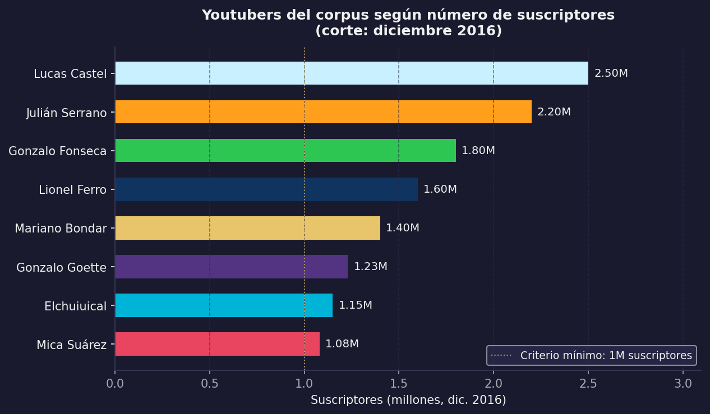{#fig-suscriptores fig-align="center" width="95%"}

::: {.content-visible when-format="html"}
::: {.callout-note collapse="true" icon="false"}
## 📊 Código fuente de esta visualización
Esta figura fue generada con el script [`viz_all.py`](scripts/viz_all.py).
Los datos provienen de `MATRIZ_FINAL_RESTAURADA.csv` (corpus: 80 videoblogs).
:::
:::

::: {#fig-collage-corpus layout-ncol=4}

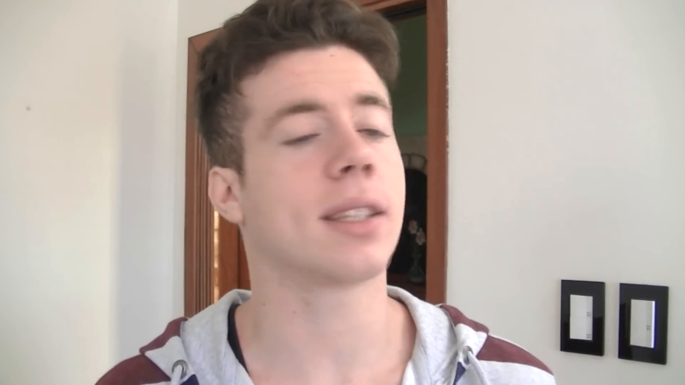{#fig-lucas}

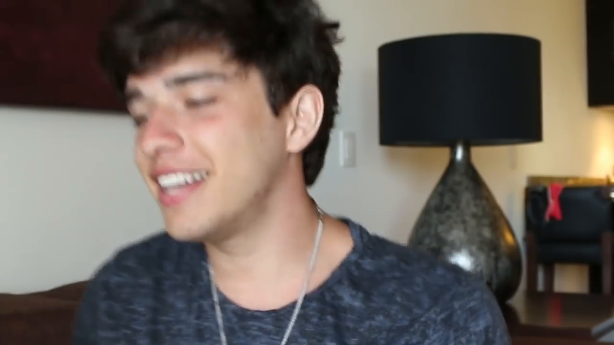{#fig-julian}

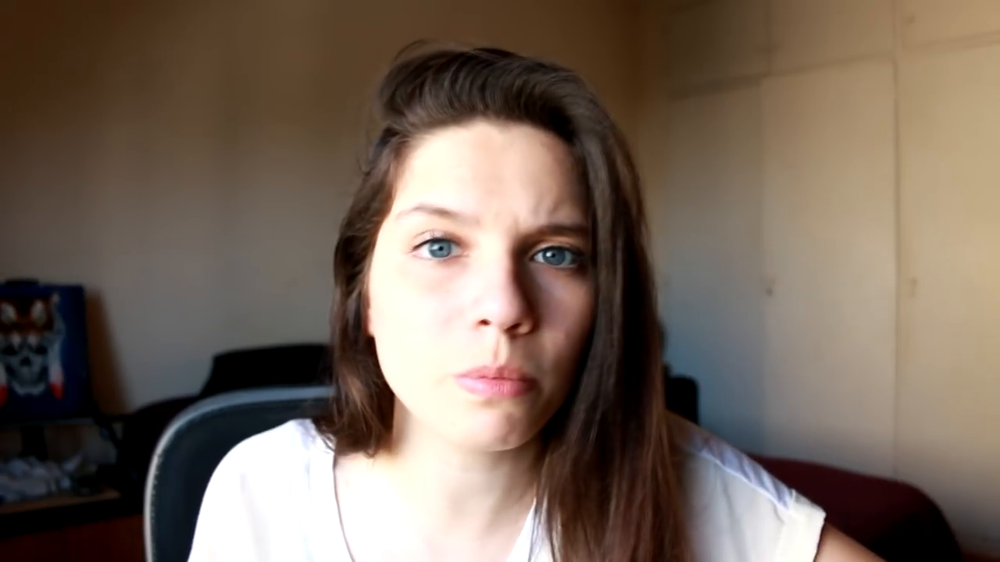{#fig-mica}

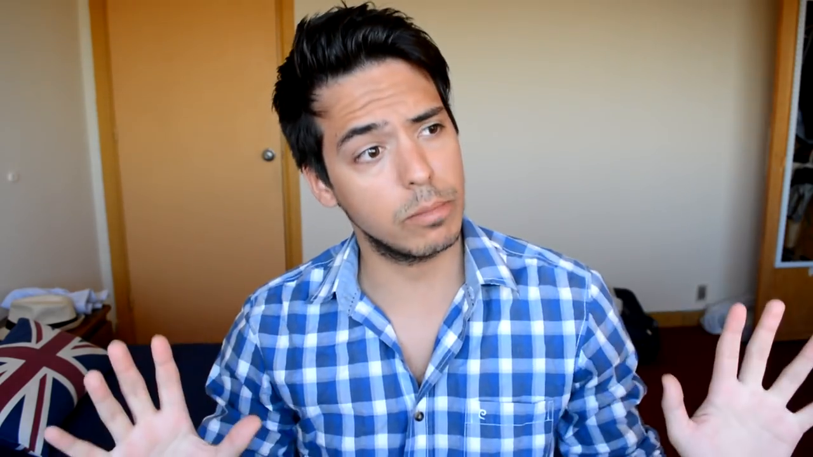{#fig-gonza}

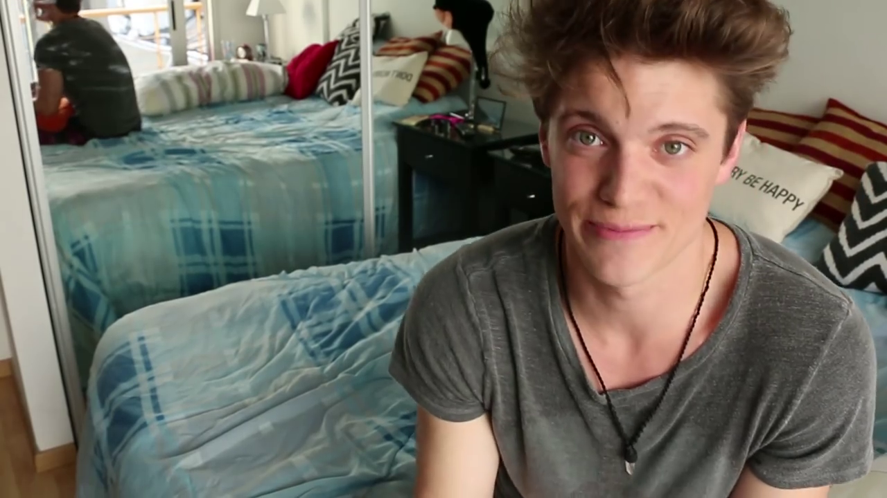{#fig-lionel}

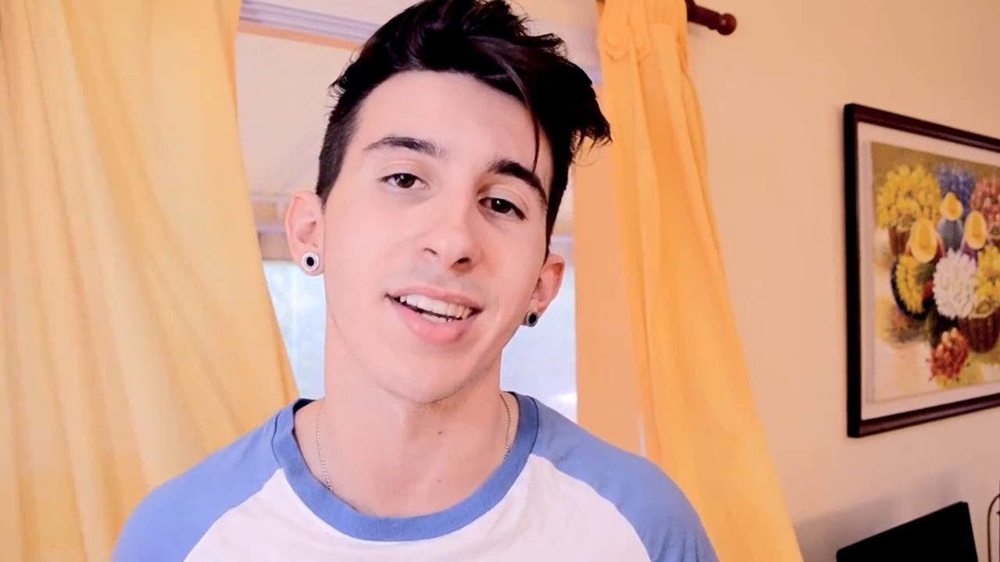{#fig-mariano}

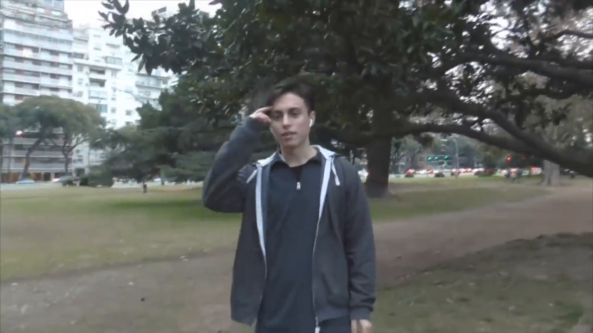{#fig-goette}

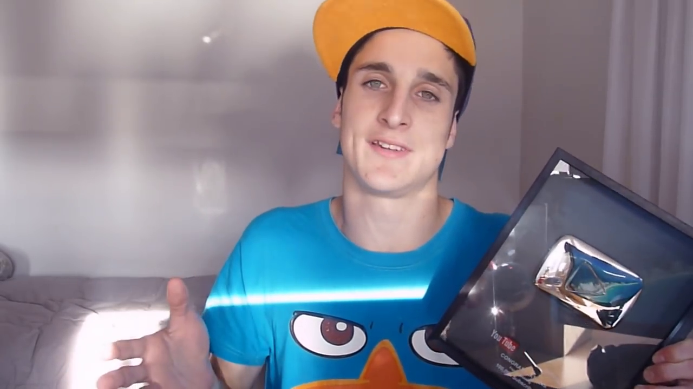{#fig-chui}

Muestra visual del corpus: los ocho youtubers en sus escenarios habituales de grabación.
:::

## Procedimientos de recolección de datos

### Descarga de videos

Para descargar todos los videos de cada canal se utilizó el software *aTube Catcher*. El procedimiento consistió en ingresar al canal del youtuber, hacer clic en "Reproducir Todo" para generar una lista de reproducción completa, copiar ese enlace y descargarlo automáticamente. Esto garantizó que si algún video era eliminado de YouTube durante el proceso de análisis(cosa que, efectivamente, sucedión con al menos una decena de videos del corpus), contaríamos igualmente con el material.

### Extracción de metadatos

Para obtener los metadatos de cada video —vistas, likes, dislikes, duración, fecha de publicación— se utilizó Google Sheets [@googlesheets2023] con funciones que dialogan con la API de YouTube. Primero se obtuvo una lista con los enlaces a todos los videos del canal mediante la extensión de Chrome Scraper; luego, en Google Sheets, se emplearon fórmulas con la función IMPORTXML para extraer datos directamente de las páginas de YouTube. La principal dificultad de este método es el tiempo de espera: Google Sheets debe acceder a cada URL y extraer los datos, lo que puede demorar varias horas para canales con cientos de videos. El resultado fueron ocho tablas, una por canal, que conforman la base de datos del corpus.

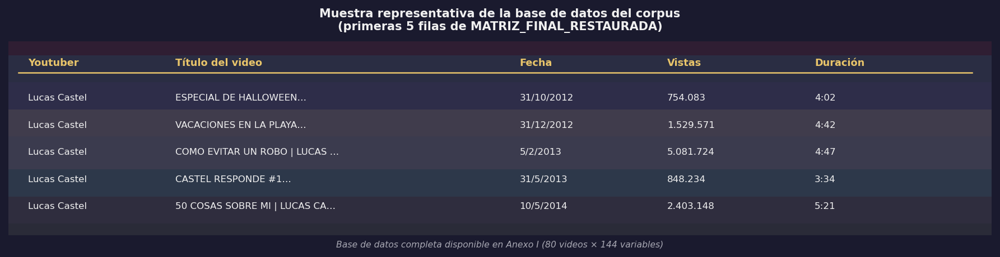{#fig-muestra-tabla fig-align="center" width="95%"}

::: {.content-visible when-format="html"}
::: {.callout-note collapse="true" icon="false"}
## 📊 Código fuente de esta visualización
Generado con [`viz_all.py`](scripts/viz_all.py) desde los datos del corpus.
:::
:::

### Transcripción de videos

Los 80 videos del corpus fueron transcritos de dos maneras complementarias. Las primeras transcripciones fueron manuales, realizadas mediante escucha repetida de cada video y escritura de todo lo verbalizado por el youtuber. Estas transcripciones se enfocaron exclusivamente en el contenido verbal, sin marcas temporales ni elementos prosódicos. El resultado fue un archivo con las transcripciones completas de 79 videos; un video no pudo ser transcrito por problemas técnicos.

Años después, se utilizó la herramienta Otter.ai [@otterai2023] para retranscribir los videos con marcas temporales precisas. Esta herramienta transcribe automáticamente el audio, segmenta la transcripción en intervalos temporales y, en los vlogs con invitados, identifica a los distintos hablantes. Además de corregir errores detectados en las transcripciones manuales previas, la retranscripción habilitó búsquedas léxicas más precisas y análisis de frecuencias que resultaron especialmente útiles en el capítulo de variedades lingüísticas.

Una vez obtenido el corpus textual completo, se realizó una exploración léxica preliminar mediante Voyant Tools [@sinclairrockwell2016; @depiero2021voyant], una plataforma de análisis textual web que permite visualizar frecuencias, distribuciones y concordancias de manera interactiva. Esta etapa exploratoria no formó parte del análisis formal, sino que cumplió una función heurística: permitió identificar las palabras de mayor frecuencia en el corpus completo, distinguir el léxico sustantivo del léxico funcional y detectar términos irrelevantes para el análisis temático (muletillas, interjecciones, marcadores de oralidad de alta frecuencia). A partir de ese relevamiento, se construyó una lista de *stopwords* adaptadas al español coloquial rioplatense para limpiar las transcripciones antes del procesamiento computacional posterior.

Esta versión procesada del corpus fue el insumo para el análisis de frecuencias léxicas con Python y para la construcción inductiva del codebook temático mediante **modelado de tópicos** (*topic modeling*) basado en el algoritmo de Asignación Latente de Dirichlet [LDA, @blei2003]. Esta técnica de aprendizaje automático no supervisado identifica patrones de co-ocurrencia entre palabras y los agrupa en temas latentes. El modelo se configuró con 10 tópicos sobre un vocabulario de 600 términos informativos. Los 10 tópicos resultantes —entre los que emergieron agrupamientos interpretados como *Emociones y vulnerabilidad*, *Humor y transgresión*, *Localidad e identidad territorial*, *Viajes y aventura* y *Gustos personales y cultura pop*— fueron contrastados con la lectura directa del corpus y reelaborados según los marcos teóricos de la investigación. Los resultados completos del modelado de tópicos, incluyendo las palabras clave por tópico y la distribución por youtuber, se presentan en el [Anexo G](anexo_f_topicmodeling.qmd). El modelado de tópicos no reemplazó la codificación manual, sino que operó como andamio heurístico: las 18 categorías temáticas del codebook son el resultado de ese diálogo entre el algoritmo y el análisis cualitativo.

## Sistema de codificación y análisis

### Diseño del sistema de codificación

El sistema de codificación se desarrolló mediante un enfoque mixto. El componente deductivo consistió en la adopción de categorías teóricas provenientes de autores como Jakobson, @goffman1959 y @feixa2014. El componente inductivo incorporó categorías emergentes del análisis directo del corpus, es decir, aquellas que no habían sido contempladas en la planificación inicial y que surgieron durante el trabajo empírico.

El sistema abarca seis niveles. El nivel textual examina las secuencias discursivas y la progresión temática dentro de los videos. El nivel funcional se ocupa de las funciones comunicativas predominantes. El nivel pragmático incluye el análisis de los actos de habla, la cortesía y la deixis. El nivel multimodal considera los escenarios, la vestimenta, la gestualidad y los planos visuales. El nivel temático examina los temas tratados y las categorías identitarias. El nivel paratextual contempla los títulos y las descripciones de los videos.

### Variables codificadas

El sistema final incluyó más de 125 variables organizadas en los siguientes constructos:

**Datos básicos:** VID, Autor, Título, Link, Vistas, Fecha de publicación, Duración, Descripción del video.

**Elementos discursivos:** destinatario implicado (DI_Uds, DI_tu, DI_indeterminado); tramas predominantes y secundarias (narrativa, descriptiva, explicativa, argumentativa, dialogal); elementos superestructurales (los ocho segmentos del vlog: Pre, Intro, Saludo, Presentación, Core, Despedida, Outro, Post); funciones comunicativas según Jakobson (referencial, emotiva, apelativa, poética, fática, metalingüística) y según @griffith2010 (narración, diario personal, indulto al narcisismo); cortesía (imágenes de afiliación o autonomía).

**Léxico y lenguaje:** expresiones coloquiales, cambio de variedad dialectal, jerga juvenil, marcas de oralidad, referencias sexuales o tabúes, dialecto propio; y léxico web: mención de YouTube, llamado a la acción, vocabulario gamer/web, mención de comunidad, mención de redes sociales.

**Elementos multimodales:** escenarios (dormitorio, sala del hogar, baño, exteriores domésticos, exteriores de viajes, interiores, exteriores); exposición del youtuber (privado/público); presencia en video (solo/acompañado); fondo del escenario; vestimenta (estilo, accesorios, presencia o cambio de ropa); planos visuales (primer plano, plano general, primerísimo primer plano, plano detalle, picado, contrapicado, plano medio, plano americano, plano secuencia, plano panorámico); elementos sonoros (música de fondo, audios enlatados, clips insertados, silencio, audio original); gestualidad y corporalidad (expresividad facial, gestos con manos, corporalidad destacada, cercanía o contacto físico, estado emocional alterado).

::: {#fig-contraste-escenarios layout-ncol=2}
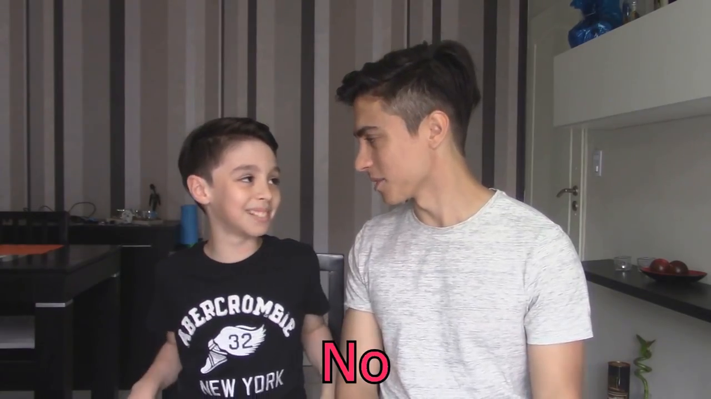{#fig-interior}

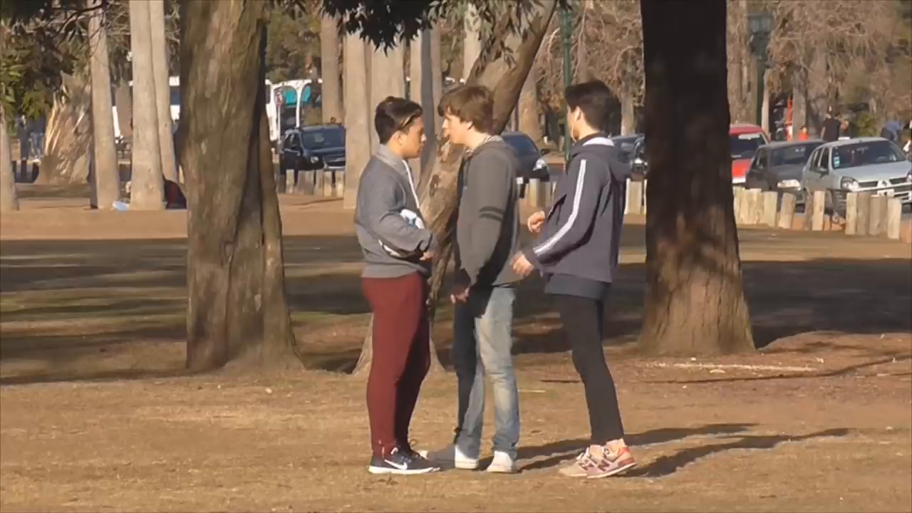{#fig-exterior}

Diversidad de escenarios en el corpus: el contraste entre la privacidad del hogar y la exposición en el espacio público.
:::

**Backstage escénico** (basado en @goffman1959): se codificó la presencia de doce rasgos, entre ellos nombres de pila, familiaridad, sexualidad, exhibición del cuerpo, dialecto, bromas, faltas de respeto y vida cotidiana.

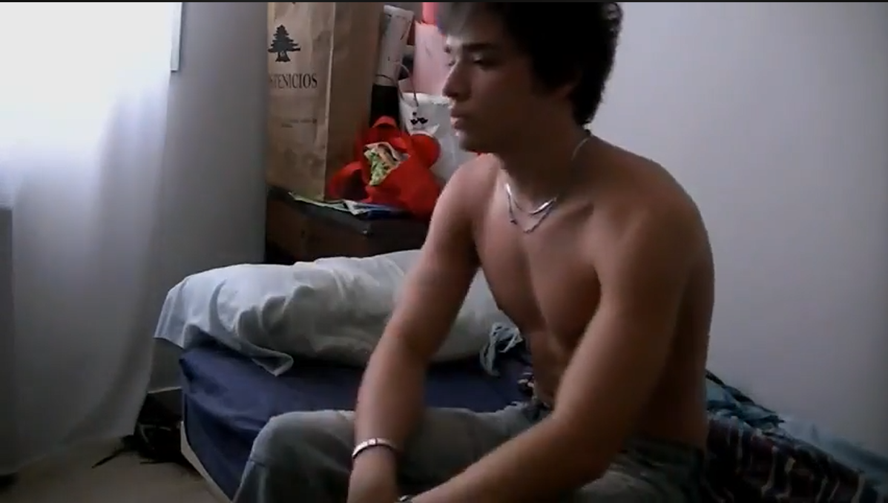{#fig-backstage fig-align="center" width="85%"}

::: {.content-visible when-format="html"}
[▶ Ver este momento en YouTube](https://youtu.be/NCXuRcYPXPY?si=kA2qTT6bXA2V9GiM&t=55){target="_blank"}
:::

**Dicotomías de culturas juveniles** (basadas en @feixa2014 y Bernete): cuatro dicotomías en escala de rango —Global/Local, Mundo joven/Mundo adulto, Comunicación en redes/Comunicación en masas, Obedecer/Distinguirse.

**Temas tratados:** se identificaron 18 temas principales mediante análisis temático —identidad y subjetividad, extimidad e intimidad compartida, familia y vínculos afectivos, amistad y comunidad, amor y sexualidad, vida cotidiana, humor y parodia, fiesta y consumo, escuela y futuro, cuerpo e imagen corporal, tecnología y cultura digital, viajes y experiencias, crítica social, emociones y autoayuda, performance y teatralidad, música y expresión artística, glocalidad y referencias culturales, lenguaje y léxico juvenil—. Para cada video se registró qué temas aparecían mediante variables booleanas más una variable de texto libre descriptiva.

**Constructo de identidad** (basado en @giddens1995 y @palazzo2010): diez variables en escala de rango que operacionalizan dimensiones de la construcción identitaria: yo-nosotros, temas actuales, reflexividad continua, narrativa de autenticidad, atemporalidad vs. actualidad, centralidad del cuerpo, riesgo vs. oportunidad estable, sinceridad, ritos de pasaje y autenticidad.

### Proceso de codificación

La codificación de los 80 videos fue enteramente manual, completando la matriz video por video. Cada video fue visto entre tres y cinco veces: en cada visualización se completaba un conjunto de variables —primero las estructurales, luego las multimodales, luego las temáticas—, y al completar varios videos se revisaban los primeros para ajustar criterios y garantizar coherencia. Para las variables léxicas y pragmáticas se consultaban las transcripciones.

Si bien este proceso llevó casi un año, permitió un conocimiento exhaustivo del corpus y una sensibilidad analítica que hubiera sido difícil de lograr con codificación automatizada. El conocimiento previo del género —adquirido tanto en la tesina de grado como en años de consumo de contenido en YouTube— aportó una experticia analítica que sustenta las decisiones interpretativas adoptadas.

### Herramientas de análisis

**Microsoft Excel** [@excel2016] fue la herramienta principal para la construcción de la base de datos y el análisis cuantitativo básico. Permitió el registro sistemático de las variables, el cálculo de frecuencias y porcentajes, la generación de tablas dinámicas para cruzar variables y la exportación de datos hacia otras herramientas.

**Python** [@python2023] —con las bibliotecas pandas [@pandas2020], matplotlib [@matplotlib2007] y seaborn [@seaborn2021]— se empleó para el análisis avanzado: frecuencias léxicas en las transcripciones, detección de patrones lingüísticos, construcción del codebook temático mediante identificación de palabras clave, cálculo de índices compuestos y generación de visualizaciones. El uso de Python no implicó automatización de la codificación, sino análisis computacional de datos ya codificados manualmente: una vez registrados los temas presentes en cada video, Python permitió calcular correlaciones entre temas, generar mapas de co-ocurrencias y visualizar patrones que serían difíciles de detectar con inspección visual de la planilla.

**Gephi** [@gephi2009] se utilizó para el análisis de redes sobre el corpus extendido —todos los videos de los 8 youtubers durante el período 2012-2016, no solo los 80 analizados en detalle—. Se identificaron manualmente las colaboraciones entre youtubers, se construyeron tablas de nodos y aristas y se visualizó la red resultante. El análisis permitió identificar agrupamientos de youtubers que colaboran con frecuencia entre ellos, revelar posiciones centrales y periféricas dentro del ecosistema y detectar patrones de asociación que trascienden el análisis individual de cada canal.

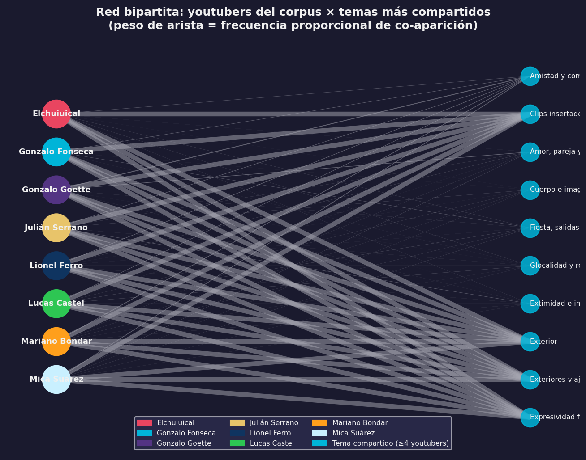{#fig-red-colaboraciones fig-align="center" width="95%"}

::: {.content-visible when-format="html"}
::: {.callout-note collapse="true" icon="false"}
## 📊 Código fuente de esta visualización
Generado con [`viz_all.py`](scripts/viz_all.py) desde los datos del corpus.
:::
:::

**Otter.ai** [@otterai2023] se utilizó para la retranscripción asistida de los videos con marcas temporales, como ya se mencionó.

## Triangulación y validación

### Proceso abductivo-reiterativo

El análisis no siguió una aplicación lineal de teorías sobre el corpus, sino un enfoque abductivo y reiterativo, con instancias de validación externa apoyadas por los proyectos PIUNT. La labor contó con la revisión y el acompañamiento de la Dra. Palazzo, y con la colaboración de pares especialistas que participaron en trabajos conjuntos previos [@narvaja2016; @palazzo2019].

Antes de integrar las categorías analíticas en la tesis, cada conjunto fue presentado como paper en eventos científicos, lo que permitió recibir críticas de pares y ajustar las categorías según observaciones externas. Los análisis de la tesis —exceptuando los índices del capítulo de identidades— recibieron validación previa en congresos nacionales e internacionales, trabajos finales de seminarios doctorales y artículos en proceso de revisión para publicación.

### Estancia de investigación en Estados Unidos

Durante una beca de investigación en los Estados Unidos, se estableció una colaboración con el Dr. Pan para desarrollar capacidades analíticas avanzadas: visualización de datos cualitativos, diseño de entrecruzamientos de variables y uso de herramientas informáticas para análisis de corpus extensos. Ese aprendizaje fue fundamental para la elaboración de mapas de calor, el análisis de correlaciones y el cálculo de índices ponderados.

### Validez y confiabilidad

En los estudios cualitativos, la validez se asegura de maneras propias y mediante criterios de rigor específicos para la investigación interpretativa [@tracy2010]. Para la credibilidad, se implementó triangulación teórica —aplicación complementaria de distintos marcos conceptuales— y triangulación metodológica —integración de métodos cuantitativos y cualitativos—, además del chequeo con pares en ámbitos académicos y la permanencia extendida en el campo: ocho años de estudio continuo sobre el objeto, desde la tesina de grado. Para la transferibilidad se realizó una descripción detallada del contexto y el corpus, se clarificaron los criterios de selección y se identificaron las limitaciones del trabajo. Para la dependabilidad se llevó un registro minucioso de cada etapa metodológica con explicación explícita de las decisiones analíticas.

## Consideraciones éticas

### Datos públicos y responsabilidad analítica

Todos los videoblogs analizados son contenidos públicos disponibles en YouTube sin restricciones de acceso. Los youtubers los subieron con expectativa de publicidad y difusión; el análisis académico de estos materiales es legítimo y no requirió permisos específicos. Sin embargo, eso no exime de responsabilidad ética.

Se decidió trabajar con los nombres reales de los youtubers, en lugar de anonimizarlos. La razón es sencilla: son figuras públicas cuya identidad de youtuber es su identidad pública construida deliberadamente. El análisis se centra en sus producciones discursivas públicas, no en aspectos privados de su vida. Anonimizar nombres como "Lucas Castel" o "Julián Serrano" sería artificial: cualquier lector mínimamente familiarizado con YouTube argentino los reconocería de inmediato. El análisis es respetuoso y crítico; no se busca exponer ni estigmatizar, sino comprender las lógicas discursivas e identitarias de sus producciones.

Cabe señalar que, si bien algunos youtubers eran menores de edad al momento de publicar ciertos videos analizados —tenían entre 15 y 17 años—, a la fecha del análisis todos son mayores de edad.

El análisis crítico del discurso no implica un juicio moral sobre las personas reales que producen los textos. Siguiendo la distinción fundamental entre el sujeto empírico y el sujeto discursivo [@charaudeau2003], cuando se señalan estrategias de construcción de intimidad o persuasión, no se está «acusando» a los youtubers de manipulación maliciosa o engaño. Por el contrario, se están describiendo las lógicas comunicativas inherentes al género videoblog. Todo acto de enunciación pública requiere una puesta en escena y la configuración de un ethos para establecer un contrato de lectura eficaz con la audiencia; revelar esos engranajes es un ejercicio analítico, no una condena ética.

## Limitaciones del estudio

Toda investigación tiene límites que conviene explicitar con honestidad. Los de este trabajo son los siguientes.

**Recorte temporal (2012-2016).** El corpus se limita a un período determinado, lo que impide reflejar la evolución subsecuente de YouTube y de los creadores incluidos. Desde 2016, la plataforma ha cambiado significativamente y los youtubers han seguido trayectorias diversas. Esta limitación no resta validez a los resultados, pero delimita su aplicabilidad: el análisis se circunscribe a la fase fundacional del videoblog argentino y no describe la situación actual. Representa, además, una oportunidad para investigaciones diacrónicas futuras.

**Restricción geográfica (Argentina).** El corpus incluye exclusivamente youtubers argentinos, lo que impide generalizar los hallazgos a otros contextos hispanohablantes. Muchas características del género son transculturales, pero las especificidades lingüísticas, temáticas e identitarias no son directamente extrapolables. Esta decisión responde a la necesidad de hacer la tesis viable y situada.

**Ausencia de análisis de comentarios.** Los comentarios de los usuarios son una dimensión fundamental en la dinámica dialógica del videoblog, pero no fueron incluidos en el corpus. Cada video tiene cientos o miles de comentarios; su análisis hubiera multiplicado exponencialmente el volumen de datos. Los comentarios quedan como corpus para investigaciones futuras sobre la construcción dialógica de comunidades en YouTube.

**Sesgo de género.** El corpus incluye solo una mujer youtuber (Mica Suárez) frente a siete varones. Esto no fue una decisión arbitraria, sino un reflejo de la realidad del ecosistema en 2012-2016: había una sola mujer youtuber con más de un millón de suscriptores. La desproporción limita las posibilidades de comparación entre construcciones identitarias masculinas y femeninas.

**Carácter manual de la codificación.** La codificación de más de 125 variables en 80 videos fue realizada por un único investigador, lo que implica tiempo —cerca de un año de trabajo intensivo— y la imposibilidad de control de confiabilidad entre codificadores. Ciertos elementos, como la distinción entre fragmentos narrativos y explicativos, podrían haber recibido una interpretación diferente por parte de otro analista. A su vez, la codificación por un único investigador ofrece ventajas claras: conocimiento profundo del corpus, sensibilidad a los matices y coherencia en la aplicación de criterios.

**Enfoque predominantemente discursivo.** El análisis centra su atención en los aspectos discursivos, multimodales e identitarios de los vlogs, relegando otras dimensiones también relevantes: la económica —monetización, profesionalización, mercado publicitario—, la tecnológica —algoritmos, infraestructura, dispositivos— y la sociológica —perfil de las audiencias, patrones de consumo—. Estas dimensiones son mencionadas, pero no desarrolladas en profundidad.

**Ausencia de la voz de los youtubers.** No se realizaron entrevistas a los youtubers del corpus para conocer sus perspectivas sobre su own trabajo, sus intenciones comunicativas ni sus representaciones sobre las audiencias. El análisis se basa exclusivamente en los textos públicos que producen. Esta elección es coherente con el enfoque del ACD —que analiza los discursos tal como circulan socialmente—, pero implica que ciertas dimensiones de sentido, como las intenciones autorales, quedan fuera de alcance.

## Aportes metodológicos

Este trabajo constituye una contribución al análisis de juventudes y culturas juveniles vinculadas a discursos digitales. El sistema de codificación multimodal —más de 120 variables en seis dimensiones— ofrece una herramienta analítica adaptable a géneros digitales variados, desde vlogs hasta gameplays, tutoriales o contenidos en plataformas emergentes como TikTok o Instagram Reels.

La integración de procedimientos cuantitativos y cualitativos —frecuencias, correlaciones e índices combinados con interpretaciones discursivas— evita extremos metodológicos y permite identificar patrones numéricos que se interpretan dentro de marcos teóricos sólidos. El modelo metodológico propuesto emplea recursos tecnológicos concretos: Google Sheets para metadatos, Python para procesamiento de datos, Gephi para visualización de redes y Otter.ai para transcripciones. La elaboración de índices ponderados —extimidad, cercanía parasocial, hibridez textual— demuestra que los conceptos teóricos complejos pueden ser operacionalizados sin renunciar a la profundidad conceptual necesaria para comprender la riqueza de los discursos juveniles en entornos digitales.
