# El videoblog como género ciberdiscursivo

## Introducción

Este capítulo aborda el videoblog como un género discursivo específico surgido en el contexto de las prácticas comunicativas juveniles en YouTube. El punto de partida es una premisa que se irá demostrando a lo largo del análisis: el vlog constituye un tipo de  singular que responde a necesidades comunicativas propias de las comunidades de jóvenes hispanohablantes, y que se caracteriza por combinar narrativas personales, secuencias argumentativas y descriptivas, y una marcada construcción discursiva de la identidad personal.

Para caracterizarlo, hay que delimitar primero el concepto de **ciberdiscurso juvenil** como marco interpretativo que vincula las prácticas lingüísticas con los contextos culturales y tecnológicos en los que emergen. Luego recorro las definiciones existentes del término "videoblog" y analizo el vlog desde perspectivas textuales, comunitarias y pragmáticas, con datos empíricos provenientes del corpus de 80 videoblogs argentinos del período 2012-2016.

## Del ciberdiscurso al ciberdiscurso juvenil

### Internet, la web y el ciberespacio

En el uso cotidiano, los términos "Internet" y "web" suelen emplearse de manera intercambiable. Vale la pena distinguirlos: "Internet" designa la infraestructura física de computadoras y dispositivos interconectados que posibilita la existencia de la web, mientras que la "web" constituye el conjunto de servidores enlazados mediante hipervínculos, conformando una red de información accesible y navegable.

Lo relevante para nuestra investigación es que la web se experimenta como un espacio, y el lenguaje que usamos para referirnos a ella recurre sistemáticamente a metáforas espaciales: navegar, recorrer, visitar, pasar. Esta experiencia de espacialidad permite introducir el concepto de ciberespacio, retomando la definición de @mayans2002, quien señala que el término se compone de dos elementos centrales: la no materialidad física y su condición de espacio practicado. La no materialidad implica deslocalización, ya que el ciberespacio no depende de categorías físicas o geográficas. La condición de espacio practicado, por su parte, se vincula con la idea de @decerteau1988, según la cual un espacio solo se constituye como tal cuando es socialmente poblado y significativo.

### El concepto de ciberdiscurso

Al abordar el lenguaje que se emplea en la web, surge la cuestión de cómo denominar los fenómenos que emergen en este entorno. La revisión de la literatura evidencia una multiplicidad de denominaciones, agrupadas según su foco de análisis en términos referidos a la comunicación, al discurso y al lenguaje:

| Grupo | Término | Autor | Año |
|:---|:---|:---|:---|
| Comunicación | *Computer Mediated Communication* | Santoro [@santoro1995] | 1995 |
| | *Computer Mediated Communication* | Thurlow, Lengel & Tomic [@thurlow2004] | 2004 |
| | Comunicación Digital Interactiva | Scolari [@scolari2008] | 2008 |
| | Comunicación Mediada por Tecnologías | Parini y Giammatteo [@parini2014] | 2014 |
| | Comunicación Digital | Parini y Giammatteo [@parini2016] | 2016 |
| | Comunicación Mediada por Computadoras | Giammatteo, Gubitosi, Parini [@giammatteo2017] | 2017 |
| Discurso | Discurso Mediado por Computadora | Herring [@herring2008] | 2008 |
| | Ciberdiscurso (juvenil) | Palazzo [@palazzo2010b] | 2010 |
| | Discurso Digital | Cantamutto & Vela Delfa [@cantamutto2016] | 2016 |
| Lenguaje | *Online language* | Paolillo [@paolillo1999] | 1999 |
| | *New Media Language* | Aitchinson & Lewis [@aitchinson2003] | 2003 |
| | *Cyberlanguage* | Gibbs [@gibbs2006] | 2006 |
| | Ciberlenguaje | Vaqueiro Romero [@vaqueiro2012] | 2012 |

: Conceptos vinculados al discurso en la web. Fuente: Elaboración propia. {#tbl-conceptos-web}

Una primera lectura de esta tabla muestra que los términos asociados a tradiciones textuales preceden a los que incorporan variación y cambio lingüístico, o análisis de la lengua oral. Esta secuencia responde tanto a las posibilidades técnicas introducidas por la web 2.0 —que profundizó la cultura participativa mediante fragmentos audiovisuales multimodales— como al renovado interés que esos fenómenos despertaron en distintas disciplinas. Es habitual encontrar el concepto de "discurso digital" en periodismo o ingeniería, mientras que la "Comunicación Mediada por Computadoras" (CMC) abunda en investigaciones vinculadas a los estudios del lenguaje.

Los términos referidos a la **comunicación** reúnen dos momentos bien diferenciados. En el primero, recuperado por @thurlow2004 y @santoro1995, la comunicación se establece entre dos computadoras sin intervención directa de personas, anticipando lo que hoy llamamos "internet de las cosas". En el segundo, los sujetos ya son humanos mediados por un dispositivo. @parini2014 definen la "comunicación mediada por la tecnología" como "la interacción entre hablantes sobre la base de textos mayormente escritos, negociada a través de vastas redes de computadoras y telefonía móvil"; en trabajos posteriores, usan indistintamente "comunicación digital" y "comunicación mediada por tecnologías" [@parini2016]. @giammatteo2017 retoman ambos términos como sinónimos en una obra temática. @scolari2008, en cambio, avanza hacia la "Comunicación Digital Interactiva", subrayando la relevancia de las interfaces como modeladoras de la comunicación contemporánea: en su concepción de las hipermediaciones, el lenguaje escrito es solo una modalidad entre otras, lo que lo diferencia de todas las definiciones anteriores.

Los términos referidos al **lenguaje** provienen principalmente de estudios sociolingüísticos. @vaqueiro2012 introduce el "ciberlenguaje" para describir los rasgos lingüísticos de la palabra en la red —hipertextualidad, faltas ortográficas, oralización del discurso escrito—; @paolillo1999, en los inicios de las redes sociales en la web, analiza el "online language" desde una perspectiva que indaga cómo el contacto entre lenguas y variedades modifica los rasgos de los hablantes; @aitchinson2003 articulan investigaciones académicas y prácticas periodísticas para comprender las transformaciones del lenguaje en los nuevos medios; y @gibbs2006 prefiere "cyberlanguage" para referirse al conjunto de palabras y expresiones asociadas a las tecnologías de la información. En síntesis, estos enfoques convergen en el reconocimiento de la mediación tecnológica como factor determinante en la variación y el cambio lingüístico.

Los términos referidos al **discurso** se inscriben en la tradición del Análisis del Discurso, orientados a examinar las formas de uso de la palabra mediada por tecnología. Aquí el foco no es la comunicación como proceso general ni el entorno como condición necesaria, sino la toma de la palabra posibilitada por los nuevos medios. @herring2008 define el discurso digital como "la comunicación producida cuando los seres humanos interactúan entre sí transmitiendo mensajes a través de computadoras conectadas". @cantamutto2016, sin precisar una definición diferenciada, lo interpretan como el discurso que se desarrolla en el entorno mediado por computadoras. La noción de "ciberdiscurso", en cambio, pone el acento en las formas de interacción en un entorno socialmente significativo: concibe la web como lo que @mayans2002, siguiendo a @decerteau1988, llamó un "espacio practicado". Es la perspectiva que adoptamos aquí, en consonancia con la línea propuesta por @palazzo2010a, quien concibe al ciberespacio como un entorno sin materialidad física, pero cargado de significado social, donde los usuarios producen sentidos y construyen identidades.

### El ciberdiscurso juvenil

El concepto de ciberdiscurso juvenil surge a partir de la noción de espacio social practicado y adquiere especificidad cuando las culturas juveniles se apropian y transforman las prácticas discursivas digitales. @palazzo2010 retoma lo planteado por @avello2007 para reconocer que la cultura juvenil construye una estética de la parodia, tanto respecto de sí misma como en relación con las culturas dominantes.

Estas características permiten considerar los discursos de jóvenes y adolescentes en el ciberespacio como formas de acción social determinadas por el registro coloquial escrito. @palazzo2010b sostiene que el ciberdiscurso juvenil constituye "una de las variedades de uso de la lengua en contextos específicos y, (...) dentro de la variedad coloquial digital oralizada" [@palazzo2021, pp. 15-16]. Sus rasgos constitutivos incluyen la producción por adolescentes y jóvenes escolarizados que interactúan en relaciones simétricas y despliegan una praxis comunicativa competente y adecuada a los cibergéneros, recontextualizando y resignificando géneros discursivos primarios y secundarios.

Al eje que Palazzo sistematiza a partir del análisis del chat, sumamos tres rasgos que consideramos constitutivos del vlog en particular. La **hibridez modal** combina oralidad y escritura, imagen fija y en movimiento, sonido y silencio, en configuraciones que desafían las taxonomías tradicionales. La **glocalidad** articula referencias culturales globales —memes internacionales, tendencias, música de moda— con marcas locales como dialectos regionales, referencias nacionales y humor situado. La **extimidad** implica la exhibición estratégica de la intimidad como forma de construir autenticidad y pertenencia comunitaria [@sibilia2008].

Adherimos a la tradición discursiva que reconoce los rasgos sociales como constitutivos de los fenómenos analizados, y usamos el término ciberdiscurso juvenil por dos motivos complementarios. El primero, porque permite incorporar perspectivas de otras ciencias sociales, como la etnografía digital y los estudios de culturas juveniles. El segundo, porque la perspectiva discursiva ofrece una interpretación más amplia de los códigos empleados en la producción del mensaje que las tradiciones textuales, que focalizan solo en lo lingüístico.

## El vlog en YouTube: definiciones y caracterización inicial

### Un recorrido histórico: blog, flog y vlog

#### Blog

El nacimiento de los blogs como espacios para compartir experiencias personales de manera cronológica fue el punto de partida para otras formas de vincularse con la web y con las comunidades de usuarios. A diferencia de los foros, donde mucha gente podía intervenir y comentar, o el chat, donde las personas compartían intercambios en tiempo real, el blog era un espacio personal, con un único autor identificable, posicionado de manera asimétrica respecto de su audiencia por su capacidad de censurar y curar sus contenidos.

El blog nació en la década de los '90 y se estabilizó hacia finales de esa misma década con el surgimiento de Blogger.com (1998), que abrió las puertas a una multitud de usuarios por la facilidad de su manejo. Esta tecnología permitió la incorporación progresiva de imágenes y videos, aunque el diseño de la interfaz siguió priorizando los textos. Esta primacía no fue neutral: entendemos la interfaz como una manera de representar la información que funciona como mediadora entre el humano y la máquina y que, detrás de su aparente naturalidad, oculta complejos procesos semio-cognitivos [@scolari2004]. En este sentido, la plataforma Blogger.com contribuyó a delimitar y estabilizar las prácticas discursivas que surgieron a partir del diseño de su interfaz: lo que los usuarios tendían a hacer estaba moldeado por lo que la interfaz facilitaba o dificultaba.

@yus2011, siguiendo a @lomborg2009, establece tres ejes para clasificar los blogs: el eje del contenido (blogs de experiencias personales, *internos*, o los que incluyen aspectos externos, *tópicos*), el eje de la direccionalidad (monológicos o dialógicos) y el eje del estilo (íntimo u objetivo). Al mismo tiempo, señala que "los *blogueros* están, en general, más interesados en la información que quieren comunicar (...) que en el diseño más o menos original del *blog*" [@yus2011, p. 127]. Aplicando la teoría de la relevancia, el autor enumera los rasgos que debe tener el blog según un esquema mental interiorizado: el diseño general con columna de entradas y barra lateral, el color de fondo, la referencia al bloguero, las secciones, el tipo de letra de las entradas, los elementos de las entradas (fecha, enlace permanente, hora, comentarios), los enlaces, el archivo del blog y los anuncios. Los elementos orientados a la interactividad —la entrada, los enlaces a blogs, los rastreos, el enlace permanente, el tablón de etiquetas y el correo electrónico— son precisamente los que contribuyen al desarrollo de comunidades en torno a este espacio.

Consideramos que el blog presenta dos rasgos que anticipan al vlog: la asimetría entre un autor identificable y su audiencia, y la construcción de comunidades mediante rituales lingüísticos. La diferencia más significativa es que en el blog la interfaz prioriza el texto; en el vlog, el video se vuelve el centro gravitacional.

#### Flog

La aparición posterior de Fotolog (2002) y de su competencia Metroflog (2004), de uso más extendido en el interior del país, implicó un cambio de perspectiva importante en la relación de la interfaz con los usuarios: esta estaba centrada en la foto como objeto central de la atención en pantalla, con una breve descripción que podía extenderse, pero que siempre debía estar vinculada a la imagen. @igarza2008 señala que "funciona como una galería de fotos o un álbum personal o grupal" (p. 26). Muchos jóvenes encontraron en estos sitios un espacio más acorde para expresarse, al punto de conformar una comunidad que se sostuvo con prácticas frecuentes tanto dentro como fuera del ciberespacio, llegando incluso a convertirse en una tribu urbana [@falco2011].

@palazzo2012a indica que la especificidad del fotolog fue delimitada principalmente por sus participantes adolescentes, por temáticas juveniles relacionadas con semiótica y estética corporal, gustos y prácticas comunes, y por el uso de una jerga cronolectal propia. En otro estudio, la autora describe al fotolog como un género discursivo y señala que

> El texto es tanto o más importante que la foto. Generalmente esta ilustra un aspecto importante del texto y otras veces el texto describe el contenido de la foto. Muchas veces se aceptan comentarios en la forma de libro de visitas, y estos habitualmente se refieren a la fotografía, o al igual que cualquier blog, a los hechos relatados. [@palazzo2012b]

En ese mismo trabajo señala que el fotolog está abierto a la cibercomunidad de pares, es creativo en su creación léxica, grafémica, fonética y visual, y encierra una profunda dialéctica entre lo privado y lo público. Lo caracteriza como el espacio "con mayor conciencia de edad social por los adolescentes y jóvenes, junto con el chat", razón por la cual el ciberdiscurso juvenil tomaba allí protagonismo especial [@palazzo2012b].

@giammatteo2009 define al fotolog, en sintonía con @parini2009, como

> un **híbrido** compuesto por imágenes asociadas con textos escritos, con una presencia fuerte y continua de elementos de oralidad. Sus productores o *f(oto)loggers* son, en su mayor parte, jóvenes adolescentes guiados por una **finalidad comunicativa** más **fático-emotiva** que factual.

@parini2009 agrega que los rasgos no ortográficos presentes en las descripciones de los posteos y los comentarios responden a la particular expresividad que los adolescentes tratan de construir con esas formas. El fotolog constituyó un hito en la evolución de los géneros en línea por la innovación que introdujo al centrar la atención en la imagen y por las nuevas formas de creatividad y socialización construidas en torno a esa práctica; elementos que permanecerán constantes también en la comunidad de youtubers.

#### Vlog

En 2005 surgió YouTube como un espacio para compartir contenido en video. Su popularización, sin embargo, llegó a finales de la primera década del siglo, cuando aumentó el acceso de la clase media a smartphones y cámaras más accesibles.

El término *vlog* es una palabra que aún no está incorporada formalmente a la lengua española. Es un sustantivo masculino originado en inglés por la fusión de "video" y "blog", siendo esta última también una fusión de "web" y "log" (diario personal o bitácora). Los diccionarios en inglés sí lo recogen: Merriam-Webster lo define como "un blog que contiene material en video" y rastrea su primer uso hacia 2002, mientras que el diccionario de Oxford lo define como "un blog en el que la publicación está realizada principalmente en forma de video". La Wikipedia en inglés lo describe como "una forma de hacer blogs para la que el medio es el video"; la española, en cambio, lo presenta como "una galería de clips de videos, ordenada cronológicamente, publicados por uno o más autores".

@igarza2008 define al videoblog como un espacio que "funciona bajo el mismo concepto que un blog, pero sus contenidos principales son imágenes audiovisuales dinámicas" (p. 278). Todas estas definiciones en lengua española tienden a presentar al vlog como un sitio, un tipo de blog, antes que como un producto discursivo. Esa diferencia es relevante: consideramos que la caracterización de **espacio** o **archivo** de videos es más adecuada para describir la plataforma que para designar los productos discursivos que analizamos.

Para nosotros, un vlog es un video que constituye un tipo particular de mensaje digital, donde un autor presenta narraciones de su vida cotidiana intercalada con comentarios sobre aspectos destacables de su relato. Combina una estructura predominantemente narrativa con segmentos descriptivos y argumentativos. También incluimos los videos en que el youtuber expone ideas o reflexiones sobre un tema, siempre conservando su carácter de discurso no ficcional.

@burgess2011 distingue dos grandes géneros propios de YouTube: el "videoblogging (vlogging) o actuaciones en vivo, donde los participantes hablan, cantan o danzan frente a la cámara, frecuentemente desde un espacio doméstico", y la esfera de "parodias, mezclas y videos virales". Y señala que "las actuaciones en vivo han sido el modo dominante de participación en YouTube; y en particular el video-blogging o vlogging se ha convertido en un conductor esencial de la 'comunidad' de usuarios" [@burgess2011, p. 6].

Es importante diferenciar entre un "youtuber" y un "vlogger". El primero designa a cualquier usuario que usa YouTube como plataforma principal para subir contenido y obtener remuneración económica, independientemente del género practicado: parodias, tutoriales, unboxing, reseñas, gameplays o contenidos educativos. El segundo refiere específicamente a quien produce vlogs. En el período analizado, ambos términos convivieron y se superpusieron, con "youtuber" ganando mayor aceptación en el español rioplatense.

### Blog, flog y vlog: síntesis comparativa

Retomando el cuadro elaborado por @palazzo2010b sobre blogs y fotologs, y agregando la caracterización de los videoblogs, se pueden observar las regularidades y diferencias según el medio:

| | **Blog** | **Flog** | **Vlog** |
|:--|:--|:--|:--|
| Representación del yo | Representación discursiva del "nosotros generacional" | Representación discursiva del "nosotros generacional" | Representación discursiva del "nosotros generacional" |
| Perfil de usuario | Joven escolarizado. Visión juvenil de temáticas variadas | Perfil adolescente. Temática juvenil | Joven, escolarizado o adolescente. Visiones juveniles de temas |
| Imagen personal | Construcción discursiva de la imagen personal. Mayor reflexión ideológica y estética | Construcción de la imagen juvenil. Estética visual | Imagen juvenil junto a imagen personal. Alto nivel de estética visual |
| Reglas regulativas | Texto/imagen, comentarios, historial | Registración, *posteo* (foto, comentario, firma) | Elementos del canal, video, descripción, título y comentarios |
| Reglas constitutivas | Estrategias de filiación y autonomía, anti-normatividad | Cortesía, filiación y autonomía, registro coloquial, anti-normatividad | Filiación, pertenencia comunitaria, anti-normatividad encauzada por reglas de YouTube |
| Registro | Coloquial escrito. Creatividad y juegos lingüísticos | Registro coloquial escrito. Juegos tipográficos | Coloquial oral y escrito. Juegos lingüísticos |
| Jerga | Mayor presencia en comentarios | — | Jerga juvenil en video y comentarios. Atenuación de variedades regionales |

: Síntesis comparativa de blog, flog y vlog. Fuente: @palazzo2010b y elaboración personal en la tercera columna. {#tbl-blog-flog-vlog}

La representación discursiva del *nosotros* generacional es una constante que atraviesa a todos los géneros, evidente en la selección de temáticas y en el empleo de la primera persona del plural. El usuario es joven, escolarizado, predominantemente de clase media a alta, con acceso a tecnologías que permiten crear productos audiovisuales de la mejor calidad que el sitio permite en cada momento. Los videoblogs requieren una mayor inversión económica que los blogs o fotologs para lograr productos que cumplan con los estándares que la propia comunidad va imponiendo.

Una constante en todos los subgéneros del vlog son los formatos comunitarios: "Draw My Life" o "50 cosas sobre mí" son prácticas habituales dentro de la comunidad de youtubers que anticipan algo importante: aunque los contenidos hablen de la propia vida y experiencia personal, están altamente condicionados por tendencias y preferencias comunitarias. Hay una evolución estética significativa en el período: los videos se filmaban en entornos muy privados —dormitorio, sala, cocina— y con el tiempo migraron hacia espacios dedicados de grabación, pequeños escenarios domésticos que en la actualidad exhiben lo que se conoce como "estética RGB", con luces de colores.

### El vlog en YouTube Argentina

A partir de estas definiciones, realizamos un primer rastreo de los youtubers argentinos con más de un millón de suscriptores a diciembre de 2016:

| N° | Canal | Suscriptores | Categoría | Tipología propuesta |
|:--|:--|:--|:--|:--|
| 1 | DrossRotzank | 9.819.999 | People | Tops |
| 2 | DisneyChannel\|LA | 4.797.326 | Entretenimiento | TV / Infantil |
| 3 | El Reino Infantil | 4.695.023 | Music | Música / Infantil |
| 4 | Karol Sevilla | 2.421.907 | Entretenimiento | TV / Música |
| 5 | Llucas Castel :D | 2.383.074 | Entretenimiento | Vlog |
| 6 | DeiGamer | 2.165.981 | Games | Gaming |
| 7 | JulianSerrano7 | 1.890.003 | Comedy | Vlog |
| 8 | JugandoConNatalia | 1.747.332 | Games | Gaming |
| 9 | Gonzaa Fonseca | 1.523.237 | Entretenimiento | Vlog |
| 10 | Daiana Hernández | 1.522.882 | Entretenimiento | Comedia |
| 11 | Lionel Ferro | 1.404.736 | Entretenimiento | Vlog |
| 12 | Alejo Igoa | 1.316.550 | Entretenimiento | Vlog |
| 14 | Mariano Bondar | 1.296.195 | Entretenimiento | Vlog |
| 17 | GonzaloGoette | 1.184.950 | Entretenimiento | Vlog |
| 19 | ElChuiucal | 1.077.119 | Entretenimiento | Vlog |
| 22 | Mica Suarez | 1.008.000 | Entretenimiento | Vlog |
| 37 | Kevsho | 583.557 | Entretenimiento | Vlog |

: YouTubers argentinos con más de un millón de suscriptores a diciembre de 2016. {#tbl-youtubers-arg}

Se observa que el escenario estaba dominado por canales que difundían contenidos originados en la televisión, junto a un comienzo incipiente de los canales de gaming. Entre los canales de vlogs, las categorías preferidas por los creadores desde su propia percepción oscilan entre "Entretenimiento" y "Comedia".

El vlog representa el 21% de los canales argentinos con más de un millón de suscriptores, conviviendo con otros formatos como tutoriales, gameplays, parodias o retransmisiones de otros medios. Esa predominancia no es casual: el vlog responde a necesidades comunicativas específicas de las juventudes contemporáneas, ofreciendo un espacio para la construcción y exhibición de identidades, la narración de experiencias vitales y la articulación de comunidades afectivas en torno a figuras reconocibles.

### Tipología de subgéneros

El término *vlog* suele usarse de modo genérico en el discurso de la plataforma, pero las prácticas efectivas muestran una diversidad de formatos reconocibles por la comunidad, que responden a rutinas y expectativas diferenciadas. La siguiente clasificación —derivada del análisis exploratorio del corpus y de la observación de tendencias regionales entre 2012 y 2016— sintetiza los principales subgéneros identificados:

| Subgénero | Rasgos definitorios | Función identitaria típica | Indicadores paratextuales |
|:--|:--|:--|:--|
| Storytime | Episodio pasado significativo; 1ª persona; clímax | Autenticación por experiencia/enseñanza | Títulos confesionales ('La vez que...') |
| Q&A | Preguntas de audiencia seleccionadas | Coautoría con la comunidad; metadiscurso | 'Preguntas y respuestas' |
| Daily/Weekly | Crónica de actividades cotidianas | Cercanía; continuidad biográfica | 'Vlog #...', 'Un día conmigo' |
| Travel vlog | Desplazamiento geográfico; exteriores | Identidad exploradora/glocal | 'Viajamos a...' |
| Challenges/Tags | Pruebas/listas rituales de plataforma | Afiliación comunitaria; humor | 'Challenge', 'Tag de...' |
| Draw my life / 50 cosas | Autoarchivo condensado; retrospectiva | Marca personal; legitimación narrativa | 'Mi historia', '50 cosas sobre mí' |

: Tipología operativa del vlog aplicada al corpus. {#tbl-tipologia-vlog}

Esta tipología no pretende agotar la variedad del género, sino ofrecer un marco terminológico que facilite el análisis comparativo a lo largo de la tesis. Cada subgénero activa un modo particular de performar el yo y de organizar la relación con la audiencia: el *storytime* apela a la autenticidad por medio de la experiencia; el *Q&A* institucionaliza la coautoría y la reciprocidad; los *daily* o *weekly vlogs* sostienen la continuidad biográfica; los *travel vlogs* privilegian la mirada exploradora y glocal; los *challenges* y *tags* consolidan la pertenencia comunitaria; y formatos como *draw my life* o *50 cosas sobre mí* condensan la narrativa identitaria y la transforman en marca personal. En conjunto, estas modalidades anticipan las categorías de representación, subjetividad e identidad que se profundizan en los capítulos siguientes.

El análisis de temas mediante modelado de tópicos —concretamente el algoritmo de Asignación Latente de Dirichlet [LDA, @blei2003]— sobre las transcripciones procesadas del corpus permitió corroborar empíricamente esta tipología. La técnica, ampliamente adoptada en humanidades digitales para la exploración de grandes corpus textuales [@graham2015explorando], identifica agrupamientos de palabras que co-ocurren con frecuencia y los organiza en *tópicos latentes*, es decir, temas «inferidos» por el algoritmo a partir de los patrones de co-presencia léxica. Los 10 tópicos resultantes se alinean estrechamente con los subgéneros descriptos: el tópico agrupado bajo palabras clave como "miedo", "vida", "verdad" y "momento" —asociado a los videos de relato personal— muestra valores altos del Índice de Autenticidad Parasocial (IAP ≈ 7.73), confirmando que el contrato de autenticidad es especialmente intenso en esos formatos. El tópico de *challenges* —dominado por "piedra", "papel", "tijera", "reto", "beso"— registra el IAP más alto del corpus (≈ 8.43), lo que sugiere que la exposición al riesgo y la participación lúdica apelan directamente a la demanda de autenticidad que constituye el núcleo del vínculo parasocial. En el extremo opuesto, los tópicos más informativos presentan valores de IAP sensiblemente menores, confirmando la modulación estratégica de la cercanía según el subgénero. Los resultados completos del modelado de tópicos se presentan en el [Anexo G](anexo_f_topicmodeling.qmd).

### Elementos constitutivos del vlog como texto multimodal

Un videoblog en YouTube no se reduce al contenido audiovisual. Constituye un **texto multimodal complejo** que integra al menos cinco componentes. El **video** propiamente dicho es el elemento central, que contiene el mensaje audiovisual. El **título** —breve, atractivo, frecuentemente con marcas de oralidad— presenta en nuestro corpus una longitud promedio de 42.8 caracteres, un 48% en MAYÚSCULAS como estrategia enfática y un 16% con signos de exclamación o interrogación que funcionan como apelaciones directas a la audiencia. La **descripción** escrita que acompaña al video amplía información, incluye enlaces y establece marcos interpretativos: el 59% de los videos incluye links en la descripción, y el 61% menciona redes sociales, evidenciando una estrategia transmedia de construcción de presencia digital. Los **comentarios** son el espacio donde la comunidad de seguidores se visibiliza y genera intercambios dialógicos. Los **videos relacionados**, sugeridos por el algoritmo, funcionan como vínculos hipertextuales implícitos que conectan el vlog al flujo más amplio de la plataforma.

Estos elementos configuran al vlog como un **texto hipertextual**, donde el sentido no se construye únicamente en el video, sino en la interacción entre todos estos componentes y en su inscripción en los flujos de contenido de la plataforma.

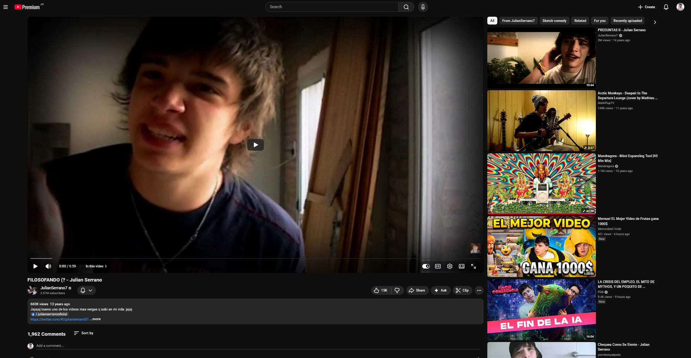{#fig-interfaz-youtube fig-align="center" width="95%"}

::: {.content-visible when-format="html"}
[▶ Ver este video en YouTube](https://www.youtube.com/watch?v=vKUz7bOnQXA){target="_blank"}
:::

### Denominaciones comunitarias y construcción de pertenencia

En el proceso de constitución de comunidades digitales, los youtubers suelen **nombrar a sus seguidores mediante apelativos específicos** que funcionan como marcadores identitarios colectivos. En España, *El Rubius* llama a su comunidad *Criaturitas*; en Chile, Germán Garmendia se dirige a los *Germanitters*; en Argentina, Julián Serrano nombra a sus seguidoras *Serranistas*, mientras que Alejo Igoa se refiere a los suyos como *Igoístas*. Estas denominaciones, lejos de ser triviales, constituyen **actos discursivos de afiliación** que dotan de existencia simbólica a un colectivo y sostienen la ilusión de cercanía interpersonal entre el creador y su audiencia [@baym2015; @papacharissi2015; @thompson1995].

El análisis del corpus evidencia que su frecuencia varía según el contexto discursivo: en contextos emocionales (videos con alta carga afectiva, momentos de extimidad o celebraciones) registramos un promedio de 7.0 menciones por video; en contextos apelativos (llamados a la acción, invitaciones a comentar o compartir), el promedio asciende a 8.2; en contextos informativos (relatos de viajes, descripciones), la frecuencia disminuye a 4.1. Esta distribución diferencial sugiere que las denominaciones comunitarias no cumplen únicamente una función referencial o fática, sino que operan como **estrategias pragmáticas de intensificación afectiva**: cuanto mayor es la necesidad de construir cercanía emocional o movilizar a la audiencia hacia una acción, más se recurre a ellas.

Las funciones pragmáticas de estas denominaciones pueden describirse en cinco dimensiones. La primera es **identitaria**: nombrar al colectivo es conferirle existencia simbólica, en la línea de la Social Identity Theory [@tajfel1986] y del concepto de *discourse community* [@swales1990]. La segunda es **fática**: retomando la función fática de @jakobson1960 y el concepto de *phatic communion* de @malinowski1923, estas denominaciones mantienen abierto el canal comunicativo y refuerzan la sensación de diálogo continuo. Expresiones como "Hola, Serranistas" o "¿Qué tal, Germanitters?" operan como saludos ritualizados que reafirman el contacto, proyectando una interacción interpersonal aun en contextos de comunicación masiva — lo que @thompson1995 describe como *quasi-interaction mediada*. La tercera función es **cohesiva**: desde la lingüística textual [@halliday1976], estas denominaciones contribuyen a la cohesión simbólica del discurso y consolidan vínculos horizontales entre los miembros, funcionando como marcas de complicidad dentro de comunidades de práctica [@wenger1998]. La cuarta es **diferenciadora**: la denominación implica simultáneamente inclusión y exclusión, según la lógica del in-group/out-group [@tajfel1986]. La quinta función es **afectiva**: siguiendo a @papacharissi2015, las comunidades digitales conforman *affective publics* articulados por emociones compartidas, lo que @baym2018 y @marwick2013 describen como un *relational labor* continuo que sostiene la conexión entre youtuber y audiencia.

En síntesis, la dimensión comunitaria del vlog muestra que no se trata de una comunicación impersonal entre un productor y una masa anónima, sino de un diálogo imaginado con una audiencia reconocida y nombrada. Aunque el medio técnico permite millones de visualizaciones, los youtubers construyen discursivamente la ilusión de una comunidad restringida, en la que la intimidad y la cercanía se negocian a través del lenguaje [@anderson1983; @marwick2013; @thompson1995].

## El vlog como género discursivo: análisis textual

### Marco teórico: hacia una tipología de géneros discursivos

El punto de partida teórico para considerar al videoblog como un género discursivo es la noción bajtiniana de **géneros discursivos** como "tipos relativamente estables de enunciados" [@bajtin1982, p. 248] ligados a esferas concretas de la actividad humana. Para Bajtín, todo enunciado refleja las condiciones específicas del campo en que se produce mediante tres componentes indisociables: el **contenido temático**, el **estilo lingüístico** y, sobre todo, la **composición o estructuración**. Estos tres rasgos se fusionan de manera orgánica en cada género y son los que permiten a los hablantes reconocer intuitivamente "de qué tipo" es un texto apenas lo encuentran.

La distinción bajtiniana entre **géneros primarios** (simples) y **géneros secundarios** (complejos) resulta especialmente fecunda para pensar el vlog. Los géneros primarios —la conversación cotidiana, el saludo, la anécdota oral— surgen en la comunicación discursiva inmediata y se caracterizan por su espontaneidad y su vínculo directo con la situación. Los géneros secundarios —la novela, el ensayo, el tratado científico— emergen en condiciones de comunicación cultural más complejas y absorben, reelaboran y transforman géneros primarios dentro de su propia estructura [@bajtin1982, pp. 250-252].

El videoblog ocupa, en este esquema, una posición singularmente dinámica. En sus manifestaciones más tempranas y menos editadas —el youtuber que enciende la cámara de su computadora y habla con la espontaneidad de una charla entre amigos—, el vlog se aproxima al polo de los géneros primarios: conversación cara a cara transpuesta a la pantalla, anécdota oral registrada en video, saludo que abre un intercambio. Pero conforme el nivel de producción y edición se incrementa —intro con logo, música original, cortes de montaje, tipografía superpuesta, guión parcial, thumbnail diseñado—, el vlog se desplaza hacia el polo de los géneros secundarios, absorbiendo y recontextualizando aquellos géneros primarios dentro de una **estructura compositiva compleja** que los resignifica. En el corpus analizado, este desplazamiento no es meramente cronológico (los videos más recientes no son siempre los más editados), sino estratégico: cada youtuber modula el grado de producción según el subgénero, la audiencia y el efecto buscado. Un *storytime* puede conservar deliberadamente la inmediatez del género primario para maximizar la autenticidad; un *draw my life* exige, por su diseño, la elaboración propia del género secundario.

El corpus ofrece un ejemplo elocuente de esta tensión. Mica Suárez arranca uno de sus *storytimes* (VID 76) con una enunciación que bien podría ser el comienzo de una conversación cotidiana entre amigas:

> "Bueno, hola YouTube, seguramente se estén preguntando por qué tengo esto acá, y bueno, ya les voy a contar. Este va a ser un video muy distinto, que nunca, de hecho nunca hice, pero... nada, yo en realidad quería sortear un celular para ustedes, para navidad, pero no me dio buenos tiempos." (VID 76, 0:00-0:11)

Las vacilaciones ("pero...", "nada"), la frase inconclusa, el léxico doméstico: todo opera en el registro del género primario, de la charla espontánea. Y sin embargo, el video está publicado en un canal con cientos de miles de suscriptores, tiene thumbnail diseñado y cierre editado. La espontaneidad del enunciado está enmarcada por la arquitectura del medio, exactamente en la bisagra que Bajtín describe entre lo primario y lo secundario.

Esta tensión constitutiva —un género que practica la espontaneidad del enunciado primario con la arquitectura del secundario— es lo que le confiere al vlog su potencia comunicativa y su dificultad para ser clasificado con herramientas diseñadas para textos puramente escritos u orales. Por ello, para la operacionalización del análisis adoptamos el modelo multinivel de @heinemann1991, quienes proponen que los géneros se definen a partir de clasificaciones multidimensionales de representaciones prototípicas. Este enfoque reconoce que "las clases textuales deben concebirse como fenómenos ideales y prototípicos, basados en las experiencias regulares de hablantes de una determinada comunidad lingüística" [@heinemann1991, en @ciapuscio1994, p. 121].

Los cinco niveles de análisis son: **tipos de función** (roles en el funcionamiento social del texto); **tipos de situación** (contextos de empleo, marco interaccional, roles, lugar y tiempo); **tipos de procedimiento** (modos de construcción textual: narrativo, descriptivo, argumentativo, expositivo, dialogal); **tipos de estructuración textual** (partes inicial, final, núcleo); y **esquemas de formulación prototípicos** (formas lingüísticas recurrentes del género). A partir de este modelo, lo que sigue es una descripción sistemática del vlog en cada uno de estos niveles, fundamentada en datos empíricos del corpus.

#### Nivel I: Funciones del videoblog

Los videoblogs realizan principalmente la función de transmitir información, combinada con la función de contacto —mantener y reforzar el vínculo con la audiencia— y la función expresiva —manifestar actitudes, emociones, opiniones. El análisis del corpus evidencia una distribución funcional relativamente equilibrada, con predominio de lo referencial-informativo: función referencial en 41 videos (51,25%), emotiva en 29 (36,25%), poética en 4 (5%) y apelativa en 6 (7,5%). La baja presencia de función apelativa explícita resulta significativa: aunque todos los vlogs buscan generar , pocos lo hacen de manera directa y dominante. La persuasión opera, más bien, a través de la construcción de autenticidad y cercanía emocional.

Sin embargo, esta categorización binaria (un video, una función) resulta insuficiente para capturar la complejidad del vlog. Por ello, desarrollamos un **índice de contexto discursivo dominante** que integra múltiples variables del corpus para identificar si cada video opera primordialmente desde un registro emocional, informativo o apelativo.

##### Contextos discursivos dominantes

Mediante un sistema de puntajes que considera función predominante, presencia de extimidad, expresividad facial, estado emocional alterado, tipo de narración, menciones a la comunidad y uso de deícticos inclusivos, clasificamos los 80 videos según su contexto dominante: informativo, 34 videos (42,5%); emocional, 31 videos (38,75%); mixto, 10 videos (12,5%); apelativo, 5 videos (6,25%).

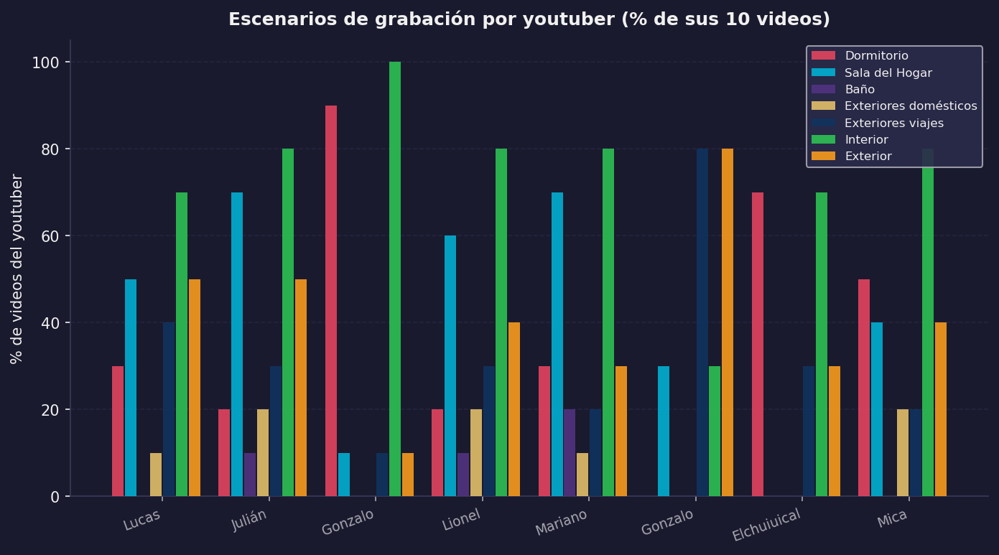{#fig-contextos-youtuber fig-align="center" width="95%"}

::: {.content-visible when-format="html"}
::: {.callout-note collapse="true" icon="false"}
## 📊 Código fuente de esta visualización
Generado con [`viz_all.py`](scripts/viz_all.py) desde `data/MATRIZ_FINAL_RESTAURADA.csv`.
:::
:::

El vlog argentino del período 2012-2016 se caracteriza por un equilibrio entre lo informativo y lo emocional, con muy baja presencia de contenido exclusivamente persuasivo. Los youtubers privilegian construir relaciones afectivas y compartir experiencias antes que solicitar acciones específicas. Hay diferencias significativas entre creadores: Gonzalo Goette presenta predominio informativo (8/10 videos); Mariano Bondar y Mica Suárez muestran predominio emocional (6/10 y 5/10 respectivamente); Lucas Castel, Julián Serrano y Gonzalo Fonseca tienen distribuciones equilibradas. Estas diferencias sugieren la existencia de "personalidades comunicativas" propias de cada youtuber, un estilo discursivo reconocible que privilegia ciertos registros por sobre otros.

#### Nivel II: Tipos de situación

##### Marco interaccional

El vlog constituye una unidad discursiva relativamente autónoma que, aunque se inscribe en flujos más amplios —series de videos, colaboraciones, trends—, funciona como unidad discreta consumible de manera independiente. Cada video posee un inicio, desarrollo y cierre relativamente autónomos, aunque frecuentemente incluya referencias intertextuales a videos anteriores o futuros.

##### Organización social y roles

La situación comunicativa del vlog oscila entre lo cotidiano y lo institucionalizado. Los youtubers construyen una estética de lo doméstico, lo espontáneo y lo amateur, pero operan dentro de marcos institucionales específicos: los marcos algorítmicos, donde las decisiones de YouTube sobre visibilidad y monetización condicionan la producción; los marcos normativos, con las políticas de contenido y restricciones etarias de la plataforma; y los marcos contractuales, que incluyen los acuerdos con marcas y patrocinadores. Esta tensión entre lo cotidiano y lo institucional atraviesa todo el género: los youtubers deben parecer auténticos y espontáneos mientras operan dentro de lógicas profesionales y comerciales cada vez más estructuradas.

En cuanto a los roles, el vlog configura una relación asimétrica, pero paradójicamente cercana. El youtuber ocupa el rol de **productor-protagonista**: es simultáneamente autor, narrador, personaje y editor de su propio contenido. La audiencia ocupa el rol de **espectador-participante**: consume pasivamente, pero puede intervenir activamente mediante comentarios, likes y compartidos. Esta asimetría se atenúa discursivamente mediante el uso de deícticos inclusivos, tratamiento informal, exhibición de vulnerabilidades y solicitud de opiniones.

##### Número de hablantes y construcción de autenticidad

El análisis del corpus revela una distribución casi paritaria: 39 videos protagonizados solo por el youtuber (48,75%) y 41 con invitados u otros participantes (51,25%). Esto contradice el estereotipo del "monólogo frente a la cámara": el vlog argentino alterna estratégicamente entre momentos de intimidad individual —que construyen autenticidad y confesionalidad— y momentos de sociabilidad grupal —que construyen dinamismo y entretenimiento. La presencia de otros participantes varía según el subgénero: los vlogs de viajes tienden a incluir más acompañantes; los vlogs reflexivos o de "draw my life" privilegian el formato individual.

Cuando el youtuber está acompañado, se dirige casi siempre al público general o interactúa con los otros participantes. Solo excepcionalmente dialoga con otro participante sin dirigirse a la audiencia, como sucede en 06GG05, donde Gonzalo Goette entrevista al youtuber Yao Cabrera sin interpelar a los espectadores. En los videos donde aparece solo, en cambio, se permite frecuentemente un tono más intimista para hablar a un "tú", construyendo un efecto de diálogo cara a cara, como en VID56.

##### Lugar y escenarios

Los escenarios del vlog constituyen marcadores identitarios y estratégicos. El corpus evidencia una distribución en la que lo privado (27 videos, 33,75%) convive con lo público (53 videos, 66,25%). Esta predominancia de lo público podría parecer contradictoria con las demandas de extimidad del género; pero muchos espacios "públicos" en los vlogs —calles, eventos, viajes— funcionan como escenarios de exhibición de lo personal: no interesan por sí mismos, sino como contextos donde el youtuber despliega su identidad.

Los tipos de escenarios específicos son: exteriores de viajes (44 videos, 55%), dormitorio (15 videos, 18,75%), sala del hogar (12 videos, 15%) y otros interiores (9 videos, 11,25%).

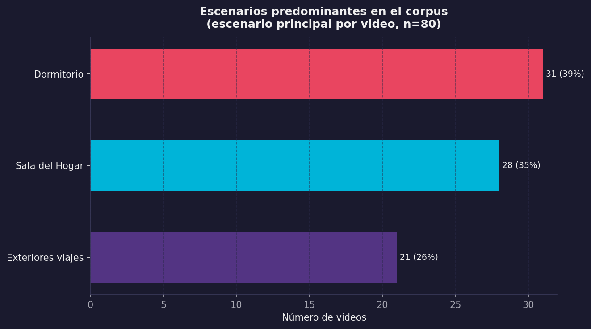{#fig-escenarios fig-align="center" width="95%"}

::: {.content-visible when-format="html"}
::: {.callout-note collapse="true" icon="false"}
## 📊 Código fuente de esta visualización
Esta figura fue generada con el script [`viz_all.py`](scripts/viz_all.py).
Los datos provienen de `MATRIZ_FINAL_RESTAURADA.csv` (corpus: 80 videoblogs).
:::
:::

El dormitorio emerge como espacio privilegiado del vlog intimista: es el escenario de las confesiones, las reflexiones personales, los videos de "50 cosas sobre mí". Siguiendo a @goffman1959, el dormitorio representa el backstage por excelencia, el espacio donde se supone que la persona se despoja de sus máscaras públicas. Exhibirlo en YouTube constituye, entonces, un gesto de autenticidad calculada: mostrar el backstage es la forma más eficaz de construir credibilidad en contextos donde la autenticidad es mercancía simbólica. Lucas Castel explicita esta lógica con naturalidad en VID 5: "Siempre filmo acá que es la casa de mis abuelos y estoy solo ahí, tranquilo. Porque ellos los fines de semana se van a su quinta y en mi casa es imposible filmar. Siempre hay ruido" (8:22-8:29). La frase revela que el backstage no es solo una categoría analítica, sino una condición material concreta: se necesita silencio, soledad, un espacio controlable. Los exteriores de viajes, en cambio, funcionan como escenarios de construcción de capital cultural y social: permiten exhibir movilidad, acceso a experiencias, cosmopolitismo juvenil.

##### Temporalidad

Los vlogs operan en una temporalidad paradójica: aunque se producen de manera asincrónica —se graban, editan y publican con desfase—, construyen discursivamente una ilusión de simultaneidad mediante el uso de deícticos temporales del presente ("hoy", "ahora", "en este momento") y marcadores de actualidad. Esta construcción de presentismo conecta con lo que @feixa2008 y otros autores han señalado como rasgo característico de las identidades juveniles contemporáneas: la centralidad del presente, la actualidad constante, la vida como sucesión de momentos significativos que deben ser registrados y compartidos.

#### Nivel III: Procedimientos textuales y secuencias discursivas

El vlog se caracteriza por su hibridez de procedimientos textuales. El análisis de las secuencias primarias reveló la siguiente distribución: narrativa en 50 videos (62,5%), dialogal en 13 (16,25%), argumentativa en 8 (10%), expositiva en 6 (7,5%), y descriptiva como dominante exclusiva en ningún video; 3 videos (3,75%) presentaron dos o más segmentos con secuencias diferenciadas.

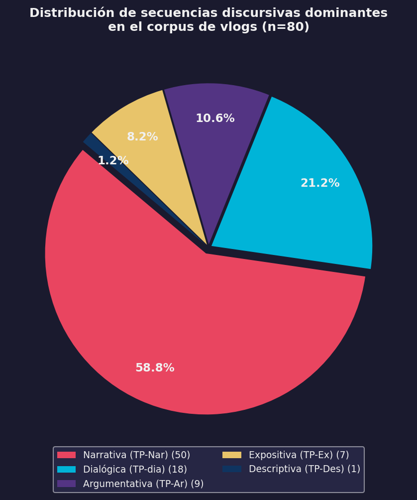{#fig-secuencias fig-align="center" width="95%"}

::: {.content-visible when-format="html"}
::: {.callout-note collapse="true" icon="false"}
## 📊 Código fuente de esta visualización
Esta figura fue generada con el script [`viz_all.py`](scripts/viz_all.py).
Los datos provienen de `MATRIZ_FINAL_RESTAURADA.csv` (corpus: 80 videoblogs).
:::
:::

La narración emerge como el procedimiento textual dominante: más de la mitad de los videos se estructuran en torno al relato de experiencias —viajes, anécdotas, eventos significativos, historias de vida—, conectando al vlog con géneros discursivos tradicionales como el relato oral, la autobiografía o el diario íntimo, con las particularidades propias del entorno digital. El segundo procedimiento en importancia es el dialogal, que incluye videos estructurados como conversaciones (entrevistas, preguntas y respuestas, interacciones con invitados). Las secuencias argumentativas y expositivas aparecen principalmente en videos que abordan temas sociales, expresan opiniones o buscan persuadir.

##### Hibridez textual

La caracterización del vlog como género narrativo sería simplificadora si no consideramos su hibridez constitutiva. El 63% de los videos presenta la narración como secuencia dominante, pero solo el 24% (19 videos) utiliza procedimientos narrativos sin combinarlos con otros. Por grado de hibridez: monológicos (una sola secuencia), 19 videos (23,75%); híbridos simples (dos secuencias), 42 videos (52,5%); híbridos complejos (tres o más secuencias), 19 videos (23,75%). El patrón más frecuente es la hibridez narrativo-dialogal (19% de los casos), donde el youtuber alterna entre relatar experiencias y construir diálogos simulados con su audiencia. Esta hibridez no es accidental, sino constitutiva: el vlog necesita narrar, opinar, describir y dialogar para cumplir sus funciones comunicativas.

Los vlogs de viajes presentan mayor hibridez que los vlogs reflexivos: el youtuber presenta una sucesión de momentos —llegada al hotel, visita a un lugar, comida, fiesta nocturna— sin construir una narrativa lineal cohesionada. Cada episodio funciona como una viñeta autónoma conectada por la continuidad temática del viaje. Este procedimiento de construcción episódica distingue a los vlogs de viaje de otros subgéneros donde predomina una estructura narrativa más cohesionada.

##### Patrones secuenciales y heatmap de transiciones

Esta matriz permite conceptualizar la estructura del vlog no como una secuencia rígida, sino como un **sistema de probabilidades** donde ciertos caminos son altamente transitados mientras otros permanecen como variantes estilísticas menos frecuentes. La hibridez no implica caos estructural, sino flexibilidad dentro de marcos probabilísticos estables.

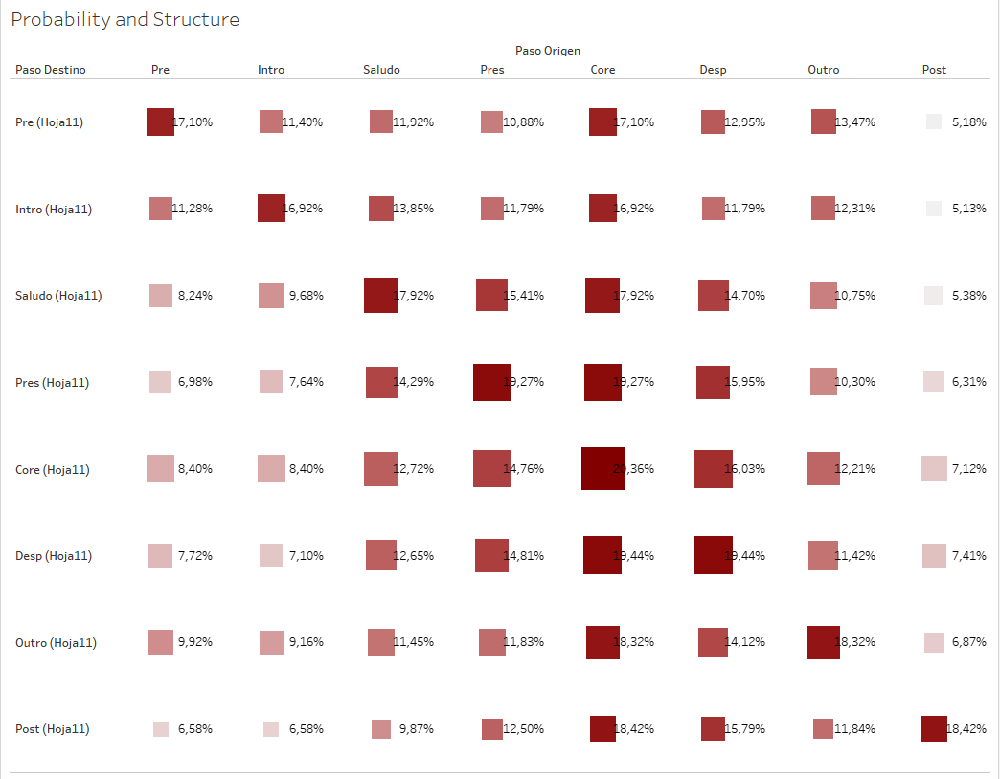{#fig-heatmap-transiciones fig-align="center" width="85%"}

#### Nivel IV: Estructuración textual

Los videoblogs presentan una estructura relativamente estable que incluye tres partes principales: inicio, núcleo temático y cierre. Antes de describir sus componentes, conviene mencionar la cuestión de la extensión de los videos, condicionada por dos factores: la eliminación progresiva de restricciones de duración en YouTube (de un minuto en los orígenes a cinco minutos en 2006, diez en 2009, y sin límites a partir de 2012) y el cambio en las políticas de monetización en 2014, que impuso un mínimo de diez minutos para poder incorporar publicidad, modificando sustancialmente los estímulos de producción.

##### Componentes superestructurales

El análisis identificó ocho componentes potenciales: el **Pre-video** (contenido anterior al inicio propiamente dicho), la **Intro editada** (secuencia de apertura con música, gráficos o logo del canal), el **Saludo** (fórmula de salutación inicial), la **Presentación del tema** (anuncio explícito del contenido), el **Núcleo temático** (desarrollo del contenido principal), la **Despedida** (fórmula de cierre), el **Outro editado** (secuencia de cierre) y el **Post-video** (bloopers, agradecimientos extendidos, avances).

La frecuencia de aparición en el corpus fue: Saludo/IntroSaludo, 62,5%; Núcleo temático, 80 videos (100%); Despedida, 76 videos (95%); Outro editado, 42 videos (52,5%); Presentación del tema, 65 videos (81,25%); Intro editada, 18 videos (22,5%); Pre-video, 12 videos (15%); Post-video, 8 videos (10%).

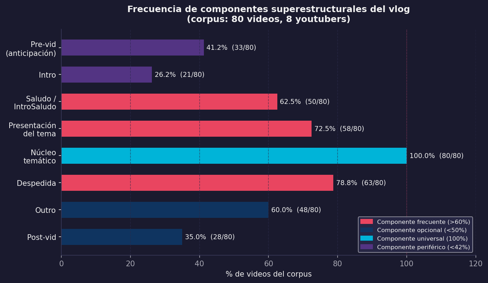{#fig-superestructura fig-align="center" width="95%"}

::: {.content-visible when-format="html"}
::: {.callout-note collapse="true" icon="false"}
## 📊 Código fuente de esta visualización
Esta figura fue generada con el script [`viz_all.py`](scripts/viz_all.py).
Los datos provienen de `MATRIZ_FINAL_RESTAURADA.csv` (corpus: 80 videoblogs).
:::
:::

La presencia de intro y outro editados diferencia los videos más profesionalizados de los que mantienen una estética más amateur. La tendencia creciente hacia la profesionalización se refleja en el incremento de estos elementos a lo largo del período 2012-2016. Pese a la variabilidad, el corpus presenta regularidades posicionales fuertes: el 62,5% de los Saludos es el primer componente real (excluyendo Pre e Intro editados); el 89% de las Despedidas ocupa la posición penúltima o última; el 100% de los Cores se posiciona como segmento central, nunca como apertura o cierre.

Esta estabilidad posicional confirma que el vlog, pese a su hibridez y estética de espontaneidad, responde a una gramática estructural implícita que los youtubers dominan y reproducen de manera competente. No se trata de fórmulas transmitidas institucionalmente, sino de conocimiento procedimental adquirido mediante la observación y la práctica dentro de la comunidad.

##### Parte inicial: rituales de apertura

La parte inicial del vlog cumple funciones de saludo, presentación del youtuber y presentación del tema. Son frecuentes fórmulas ritualizadas que funcionan como marcas identitarias de canal. En el corpus, estas fórmulas van desde el tratamiento cortés hasta la irrupción espontánea:

> "Bienvenidos amigos, ¿cómo están?" — Lucas Castel (VID 3, 0:06)   
> "Hola gente, ¿cómo están?" — Julián Serrano (VID 11, 0:06)   
> "Hola, ¿cómo están?" — Mariano Bondar (VID 50, 0:05)   
> "Bueno, eh, básicamente no veo una mierda. ¡Hola, YouTube!" — Mica Suárez (VID 72, 0:00-0:02)   
> "Bien gente, vamos a dar vuelta en un nuevo día" — Elchuiuical (VID 63, 0:00)    
> "Esta vez volví para hablarles de un tema que me está rompiendo bastante las pelotas últimamente" — Mariano Bondar (VID 41, 0:00)

La variedad es reveladora. La secuencia Castel → Serrano → Bondar muestra tres grados del mismo gesto fático: el "Bienvenidos" de Castel conserva algo del protocolo del anfitrión; el "Hola gente" de Serrano reduce la formalidad al mínimo; Bondar directamente omite el saludo en VID 41 y arranca con el tema. En el otro extremo, Mica Suárez convierte la fórmula en un acto de antirretórica: empieza diciendo que no ve nada y recién después saluda. Cada variación es una decisión estilística que posiciona al youtuber frente a su audiencia.

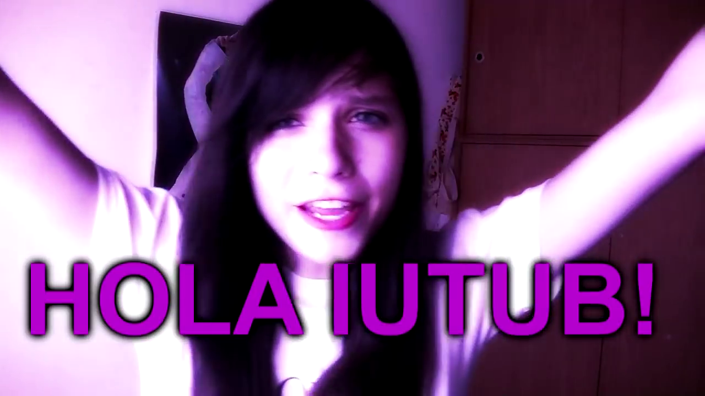{#fig-saludo fig-align="center" width="85%"}

::: {.content-visible when-format="html"}
[▶ Ver este momento en YouTube](https://youtu.be/1claW_OqGQw?si=0XCmxaayclzMgB6f){target="_blank"}
:::

Estas fórmulas combinan elementos del saludo conversacional cotidiano con marcas de oralidad propias del ciberdiscurso. El uso predominante de segunda persona plural ("chicos", "gente", "amigos") construye una audiencia colectiva, mientras que la pregunta fática sobre el estado ("¿cómo están?", "¿cómo andan?") simula un diálogo cara a cara. La presentación del tema, presente en el 81,25% de los videos, funciona como marco orientativo que establece expectativas sobre el contenido. Puede ser explícita ("En este video les voy a contar...") o implícita, comenzando directamente con el relato.

##### Núcleo temático

El núcleo temático es el cuerpo principal del video donde se desarrolla la narración, descripción, argumentación o diálogo que motiva la producción. Su extensión es variable —de 2 a 15 minutos en el corpus, con una media de 5 minutos— y su estructuración interna depende del tipo de secuencia textual dominante y del grado de hibridez del video. En videos con alta hibridez, el núcleo puede segmentarse en bloques temáticos delimitados por cortes de edición, cambios de escenario o transiciones musicales, respondiendo tanto a necesidades narrativas como a lógicas algorítmicas de retención de la atención.

##### Parte final: rituales de cierre

La parte final cumple funciones de despedida y refuerzo del vínculo comunitario. Las fórmulas de despedida, presentes en el 95% de los videos, articulan al menos cuatro tipos de elementos: la despedida propiamente dicha ("Nos vemos en el próximo video", "Chau chau", "Hasta la próxima"); la apelación a la interacción, presente en el 68,75% de los cierres ("Dejen sus comentarios", "Denle like si les gustó", "Compartan el video", "Suscríbanse si son nuevos"); los agradecimientos a la audiencia, en el 45% ("Gracias por ver", "Los quiero mucho", "Gracias por el apoyo"); y los anuncios de próximos contenidos, en el 32,5% ("El próximo video va a ser sobre...", "Nos vemos el viernes con...").

La despedida de Lucas Castel en VID 5 condensa los cuatro elementos en un cierre prototípico:

> "Muchísimas gracias por apoyarme siempre. Por darle me gusta a los videos. Por compartirlos. Nos vemos en la próxima. Cuídense. Yo soy Lucas Castel." (VID 5, 9:23-9:29)

Agradecimiento, llamado a la acción, despedida, firma identitaria: el cierre funciona como un ritual compacto donde cada elemento ocupa su lugar, casi litúrgico en su previsibilidad. Pero el corpus muestra también cierres que rompen esa liturgia. Mariano Bondar en VID 41 cierra así:

> "Muchas gracias por ver el video hasta el final. Ojalá vuelva a hacer otro video porque la verdad me divierto mucho editando y grabando estos videos. Ojalá llegue a algún lado con esto, no sé. Chau pedazo de forro." (VID 41, 5:58-6:07)

El "ojalá llegue a algún lado con esto" introduce una incertidumbre que la retórica del éxito del youtuber suele evitar, y el "chau pedazo de forro" —un insulto cariñoso, una provocación que reclama complicidad— cierra con una marca de oralidad que difícilmente aparecería en un guión. Ese gesto, que colisiona el agradecimiento con el insulto, es Bondar: su estilo discursivo condensado en seis palabras.

En el extremo opuesto, Julián Serrano cierra su "Draw My Life" (VID 13) con un registro inusualmente emotivo:

> "En verdad, gracias. En serio. Gracias por estar siempre del otro lado. Te mando un abrazo a vos que estás viendo esto y que tengas un buen día." (VID 13, 5:09-5:14)

El paso del plural ("ustedes") al singular ("a vos que estás viendo esto") es una estrategia de cercanía parasocial que individualiza al espectador: ya no habla a una audiencia, habla a *una persona*.

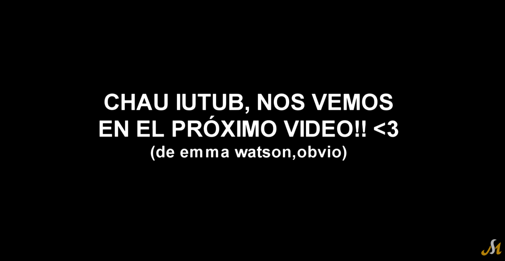{#fig-despedida fig-align="center" width="85%"}

::: {.content-visible when-format="html"}
[▶ Ver este momento en YouTube](https://youtu.be/1claW_OqGQw?si=ufMAoahpCh1m8LDN&t=596){target="_blank"}
:::

La presencia de llamados a la acción en más de dos tercios de los cierres evidencia la tensión entre la lógica relacional (construir comunidad afectiva) y la lógica algorítmica (generar engagement mensurable). Los youtubers deben solicitar explícitamente interacciones porque el algoritmo de YouTube prioriza videos con alto engagement, pero deben hacerlo sin romper la ilusión de autenticidad y espontaneidad que caracteriza al género.

##### Más allá de la estructura: co-ocurrencias y densidades temáticas

El análisis estructural del vlog permite caracterizar cómo se organiza el género, pero no captura de qué hablan los vlogs ni cómo se relacionan entre sí los temas tratados. Para abordar estas dimensiones, recurrimos al heatmap de co-ocurrencias temáticas y al gráfico de dispersión frecuencia-profundidad.

El heatmap de co-ocurrencias revela "constelaciones temáticas" recurrentes. La primera es la constelación identitaria-afectiva: "Identidad y subjetividad" co-ocurre fuertemente con "Extimidad e intimidad compartida" (0.38), "Familia y vínculos afectivos" (0.15) y "Emociones, motivación y autoayuda" (0.27). Esta constelación evidencia que, en el vlog argentino, la construcción identitaria se articula mediante la exhibición de lo íntimo y lo afectivo, confirmando lo planteado por @sibilia2008 sobre la extimidad como lógica dominante de las subjetividades contemporáneas. La segunda es la constelación juvenil-comunitaria: "Amistad y comunidad" co-ocurre con "Fiesta, salidas y consumo" (0.10), "Humor y parodia" (0.06), "Lenguaje, dialecto y léxico juvenil" (0.29) y "Tecnología y cultura digital" (0.15) — el vlog no solo habla *sobre* la cultura juvenil, sino que la practica discursivamente. La tercera es la constelación cotidiana-narrativa: "Vida cotidiana" co-ocurre con "Viajes y experiencias" (0.18), "Escuela, estudios y futuro" (0.18) y "Familia y vínculos afectivos" (0.30), lo que evidencia que lo cotidiano en el vlog no es banal, sino lo vivido como significativo.

Una ausencia llamativa: "Tecnología y cultura digital" presenta co-ocurrencias bajas con la mayoría de los otros temas. La respuesta es que la tecnología está naturalizada: no es tema de reflexión explícita, sino condición de posibilidad del discurso. Los youtubers no hablan de YouTube, hablan *en* YouTube. Esta observación es coherente con el tópico latente de *marcos culturales y referencias globales* detectado en el modelado LDA (T1), donde el contexto digital aparece como telefón de fondo antes que como objeto de reflexión explícita —una diferencia significativa respecto de los vlogs de generaciones posteriores, que –según indica la literatura– desarrollan mayor conciencia metaplataforma [@cunningham2019].

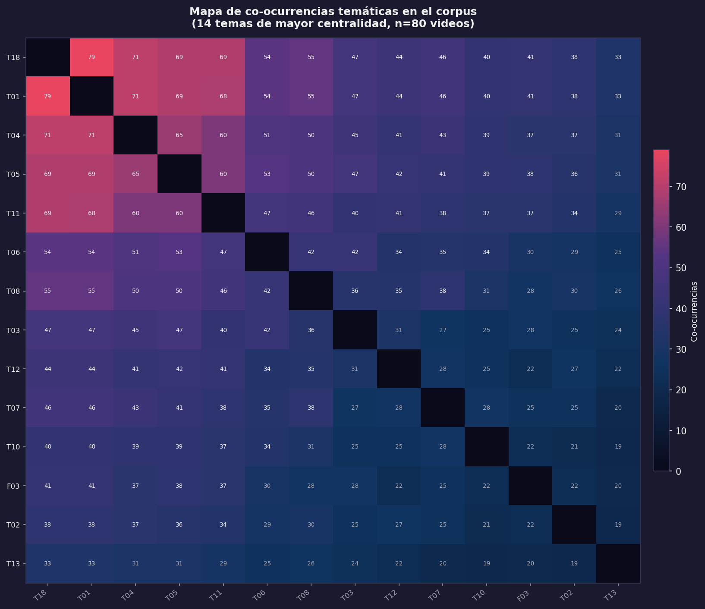{#fig-heatmap-cooc fig-align="center" width="95%"}

::: {.content-visible when-format="html"}
::: {.callout-note collapse="true" icon="false"}
## 📊 Código fuente de esta visualización
Generado con [`viz_all.py`](scripts/viz_all.py) desde `data/MATRIZ_FINAL_RESTAURADA.csv`.
:::
:::

El gráfico de dispersión frecuencia-profundidad permite distinguir entre temas omnipresentes, pero superficiales y temas menos frecuentes, pero intensos cuando aparecen. Los temas de **alta frecuencia y alta profundidad** —los nucleares del vlog argentino— son "Identidad y subjetividad" (frecuencia: 0.80, profundidad: 0.0085), "Lenguaje, dialecto y léxico juvenil" (0.88 / 0.0119) y "Vida cotidiana" (0.80 / 0.0093). Los temas de **alta frecuencia, pero baja profundidad** son "Tecnología y cultura digital" (0.89 / 0.0126) y "Humor y parodia" (0.61 / 0.0054): omnipresentes como tono o telón de fondo, pero difusos como contenido explícito. Los temas de **baja frecuencia, pero alta profundidad** —especializados o situacionales— son "Música, danza y expresión artística" (0.50 / 0.0072) y "Viajes y experiencias" (0.55 / 0.0062). Los **marginales** en ambas dimensiones son "Performance y teatralidad" (0.10 / 0.0029) y "Crítica social y conflicto" (0.35 / 0.0035).

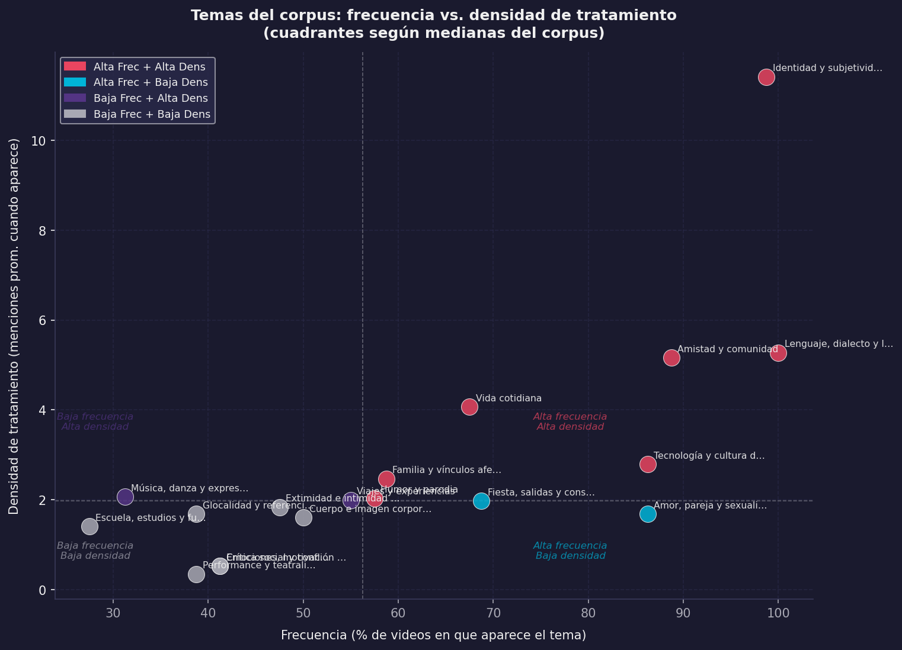{#fig-scatter-freq fig-align="center" width="95%"}

::: {.content-visible when-format="html"}
::: {.callout-note collapse="true" icon="false"}
## 📊 Código fuente de esta visualización
Generado con [`viz_all.py`](scripts/viz_all.py) desde `data/MATRIZ_FINAL_RESTAURADA.csv`.
:::
:::

Esta distinción entre frecuencia y profundidad permite refinar las interpretaciones: "Tecnología y cultura digital" es el tema más frecuente del corpus (89%), pero su baja densidad indica que funciona como telón de fondo. "Identidad y subjetividad", con frecuencia similar (80%), presenta densidad mucho mayor: cuando los youtubers hablan de sí mismos, lo hacen con intensidad y extensión.

#### Nivel V: Esquemas de formulación prototípicos

Los esquemas de formulación son las formas lingüísticas recurrentes que caracterizan al género. En el vlog, operan en varios niveles complementarios.

Las fórmulas de apertura y cierre ya fueron descritas: vocativos colectivos ("chicos", "gente", "amigos"), preguntas fáticas ("¿cómo están?"), imperativos apelativos ("denle like", "suscríbanse") y promesas de continuidad ("nos vemos pronto"). Los marcadores de oralidad incluyen muletillas ("bueno", "o sea", "tipo", "ponele"), titubeos y autocorrecciones ("ehh", "mmm", "digo"), expresiones coloquiales (presentes en el 73,75% de los videos) y jerga juvenil (41,25%). Estos marcadores construyen una "espontaneidad" que es, paradójicamente, el resultado de edición y producción: la mayoría de los vlogs no son improvisaciones, sino performances de espontaneidad cuidadosamente construidas.

El vlog hace uso intensivo de deícticos que construyen ilusión de copresencia. En los personales, "ustedes" está presente en el 91,25% de los videos como forma de tratamiento dominante, mientras que "tú/vos" solo aparece en el 5%; las formas inclusivas ("nosotros", "vamos") en el 46,25%. El predominio abrumador de "ustedes" sobre "tú" es significativo: el youtuber argentino construye una relación de cercanía sin tuteo individual, hablando a una audiencia colectiva con una forma que, en el español rioplatense, combina horizontalidad con la amplitud de alcance del plural. Las formas inclusivas en casi la mitad de los videos revelan estrategias de construcción de comunidad: el "nosotros" borra momentáneamente la asimetría productor-audiencia.

Las referencias metadiscursivas a la plataforma y al género aparecen en una porción significativa del corpus: menciones a YouTube en el 33,75% de los videos, referencias al acto de filmar ("estoy grabando", "prendí la cámara"), comentarios sobre la edición ("acá voy a poner", "en este momento edité") y alusiones al algoritmo o las métricas ("si llegamos a X likes", "YouTube no me está mostrando"). Estas referencias evidencian una reflexividad genérica: los youtubers saben que producen vlogs, conocen las convenciones del género y las explicitan o subvierten de manera deliberada.

## El vlog como práctica comunitaria: análisis desde Swales

### Comunidades discursivas y géneros

@swales1990 sostiene que los géneros discursivos no son entidades abstractas, sino que surgen en respuesta a las necesidades comunicativas de comunidades discursivas específicas. Para que exista una comunidad discursiva, sus integrantes deben compartir objetivos públicos y contar con mecanismos de comunicación interna, utilizar géneros textuales orientados a sus metas, incorporar vocabulario técnico propio y disponer de miembros con conocimientos especializados.

En Argentina, los youtubers activos entre 2012 y 2016 constituyen una comunidad discursiva aún en formación que reúne estos requisitos. Entre los objetivos comunes se identifican el desarrollo de audiencias, la manifestación de identidades juveniles, la monetización de contenidos y la participación en tendencias globales desde perspectivas locales. Los mecanismos de interacción incluyen comentarios en videos, colaboraciones entre creadores, menciones y referencias cruzadas, eventos presenciales (MediaFest, encuentros con seguidores) y redes sociales complementarias.

El género predominante es el vlog, con sus subgéneros. El léxico específico incorpora términos web y gamer presentes en el 45% de los contenidos: "haul", "unboxing", "challenge", "tag", "shippear", "collab", "shoutout". El expertise compartido abarca dominio técnico (iluminación, edición, audio), conocimiento algorítmico (funcionamiento de YouTube, estrategias de SEO) y experiencia acumulada sobre las expectativas de las audiencias.

### El vlog como solución a necesidades comunicativas juveniles

Siguiendo a @bergmann1995, los géneros discursivos responden a necesidades comunicativas específicas de las comunidades que los producen. El vlog responde al menos a cinco.

En contextos donde la existencia social se juega en términos de visibilidad mediática [@sibilia2008], el vlog ofrece un espacio para la visibilidad identitaria: exhibirse, narrarse y construir una identidad pública donde la extimidad tiene su formato ideal. El sistema de métricas del vlog (vistas, likes, comentarios, suscriptores) ofrece formas cuantificables de validación afectiva que reemplazan o complementan las que antes proveían instituciones como la familia o la escuela.

La construcción narrativa del yo en la modernidad tardía requiere formas de narración biográfica continua [@giddens1995]: el vlog funciona como diario audiovisual que permite construir y reconstruir permanentemente las narrativas vitales. La pertenencia comunitaria en contextos de individualización creciente encuentra en el vlog formas de afiliación flexible a comunidades afectivas construidas en torno a figuras reconocibles.

Frente a medios de comunicación tradicionales donde los jóvenes eran meros consumidores, YouTube ofrece posibilidades de producción cultural autónoma: el vlog permite agencia expresiva para ser simultáneamente productores, distribuidores y curadores de contenido.

## Análisis pragmático: actos de habla y construcción de relaciones

### Actos de habla recurrentes en el vlog

El análisis pragmático permite identificar actos de habla característicos que construyen y mantienen las relaciones entre youtubers y audiencias. Los actos dominantes del corpus son: afirmaciones/declaraciones (opiniones personales, relatos, declaraciones identitarias) en el 68,75% de los videos; preguntas dirigidas a la audiencia (retóricas, genuinas o fáticas) en el 56,25%; agradecimientos por ver, suscribirse o apoyar en el 45%; pedidos (fomento de la interacción, solicitud de opinión, difusión de contenido) en el 68,75%; promesas (de continuidad, publicación de nuevo contenido, respuesta a demandas) en el 32,5%; y disculpas (por demoras, errores o aspectos técnicos de calidad) en el 18,75%.

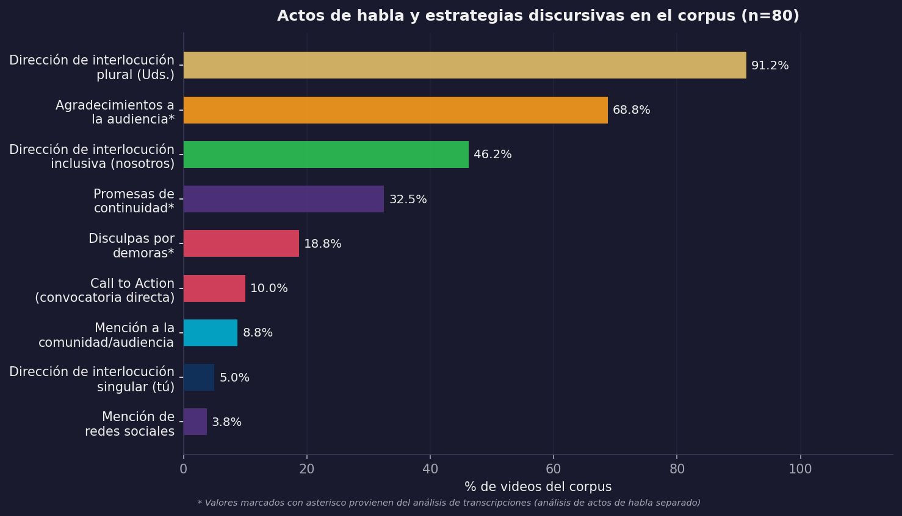{#fig-actos-habla fig-align="center" width="95%"}

::: {.content-visible when-format="html"}
::: {.callout-note collapse="true" icon="false"}
## 📊 Código fuente de esta visualización
Generado con [`viz_all.py`](scripts/viz_all.py) desde los datos del corpus.
:::
:::

La predominancia de afirmaciones y pedidos confirma el carácter híbrido del vlog entre lo expresivo y lo apelativo. La presencia significativa de disculpas evidencia que los youtubers construyen una relación de compromiso con su audiencia donde la ausencia o el error requieren reparación discursiva: contradice la idea del vlog como espacio amateur sin obligaciones.

### Estrategias de cercanía discursiva

El vlog juvenil no opera desde la lógica adulta de cortesía formal —deferencia, distancia, respeto a jerarquías— sino desde una lógica de familiaridad que privilegia la horizontalidad, la informalidad y la exhibición de . Para cuantificar estas estrategias, desarrollamos un **índice de cercanía discursiva** (ICP) que integra cinco indicadores: uso de deícticos inclusivos (2 puntos, por generar identidad colectiva y minimizar asimetrías), uso de nombres de pila (1 punto, marcado de familiaridad hacia la audiencia), presencia de bromas (1 punto, fomento de complicidad), referencia a la comunidad (1 punto, reconocimiento explícito del colectivo) y representaciones de afiliación (1 punto, sentido de pertenencia por sobre la autonomía).

La distribución del ICP en el corpus es: cercanía baja (ICP ≤ 3.38), 16,2%; cercanía media (3.38 < ICP ≤ 5.62), 62,5%; cercanía alta (ICP > 5.62), 21,2%.

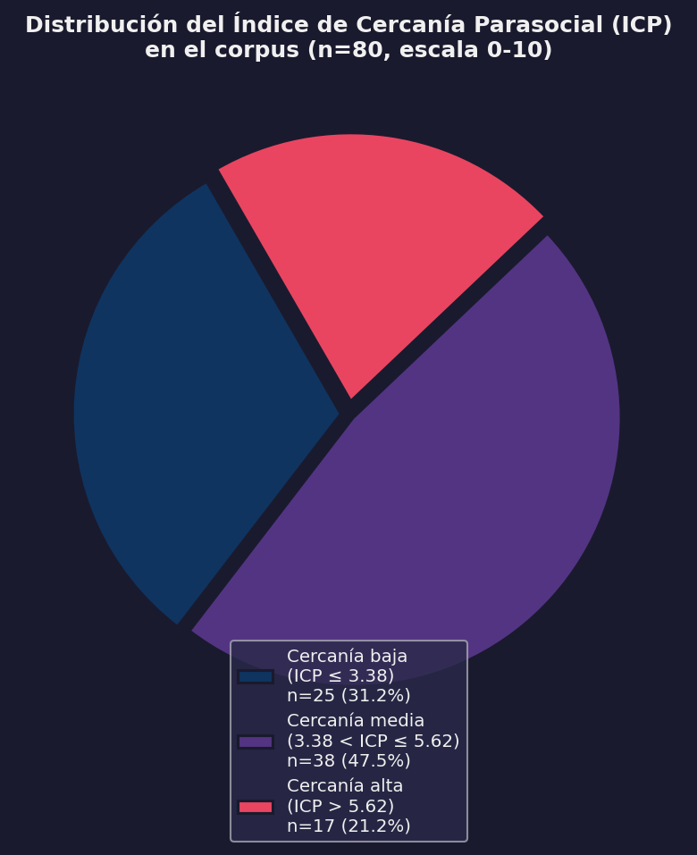{#fig-icp-torta fig-align="center" width="95%"}

::: {.content-visible when-format="html"}
::: {.callout-note collapse="true" icon="false"}
## 📊 Código fuente de esta visualización
Esta figura fue generada con el script [`viz_all.py`](scripts/viz_all.py).
Los datos provienen de `MATRIZ_FINAL_RESTAURADA.csv` (corpus: 80 videoblogs).
:::
:::

La predominancia de videos con cercanía media (62,5%) sugiere que los youtubers modulan estratégicamente la construcción de intimidad: los videos informativos y narrativos de viajes tienden a puntuar más bajo, mientras que los reflexivos, confesionales o comunitarios puntúan más alto. El cruce entre ICP y contexto discursivo confirma esta modulación: en el contexto emocional hay un 35,5% de cercanía alta; en el informativo, solo un 8,8%; en el apelativo, un 40%. Cuando el youtuber busca generar conexión afectiva o movilizar a la acción, despliega más recursos de familiaridad.

### El backstage goffmaniano como estrategia de autenticidad

@goffman1959 distinguió entre  (la región donde los actores sociales despliegan sus performances públicas) y  (la región donde se relajan y se muestran "auténticos"). El vlog opera mediante una exhibición calculada del backstage: los youtubers muestran su dormitorio, hablan en lenguaje coloquial, hacen bromas, exhiben vulnerabilidades. Lo que tradicionalmente era backstage —lo íntimo, lo informal, lo no elaborado— se convierte en el contenido mismo del vlog.

El análisis de rasgos de backstage en el corpus evidencia su ubicuidad: familiaridad, 80 videos (100%); dialectos regionales, 80 videos (100%); nombres de pila, 74 videos (92,5%); bromas, 74 videos (92,5%); gritos y maldiciones, 60 videos (75%); descuidos corporales (bostezos, estornudos), 48 videos (60%); referencias a sustancias (alcohol, etc.), 28 videos (35%).

La omnipresencia de estos rasgos confirma que el backstage es constitutivo del género: no es una transgresión ocasional, sino la norma esperada. Esta inversión de la lógica goffmaniana responde a las demandas de autenticidad en culturas juveniles digitales: parecer "real", "genuino", "sin filtros" es condición de credibilidad. Paradójicamente, esta autenticidad es una *performance* cuidadosamente producida: los youtubers editan, seleccionan y construyen su backstage de manera tan deliberada como cualquier frontstage tradicional.

### Elementos multimodales de los videoblogs

Los videoblogs recurren a distintas herramientas para comunicar el contenido. Siguiendo a @kress2009, un modo es "un recurso semiótico para construir sentidos, socialmente construido y culturalmente brindado. Imágenes, escritura, disposición, gestos, habla, imágenes móviles, sonido y objetos tridimensionales son ejemplos de modos usados en la representación y en la comunicación" (p. 79). Modos diferentes ofrecen diferentes potenciales semióticos que inciden en la elección del modo en instancias específicas de comunicación. En los videos se observa cómo estos recursos se articulan para comunicar sentidos convergentes o divergentes; en ocasiones, el habla y la imagen producen contradicciones que el modo gestual termina de desambiguar.

#### Audio

La presencia de música de fondo es casi constante: aparece en 68 de los 80 videos analizados. Doce de ellos añaden otra capa de audio con sonidos pregrabados o música con copyright para enriquecer la experiencia; este uso, sin embargo, cayó en desuso con los cambios en las regulaciones del sitio sobre derechos de autor. En la actualidad, algunos videos (por ejemplo, 08MS05a y b) presentan partes en absoluto silencio que son huellas de esos audios suprimidos por la plataforma. Solo excepcionalmente encontramos videos que emplean el silencio como recurso expresivo deliberado —para acentuar efectos dramáticos o cambiar el "tono" hacia uno más serio.

#### Planos de filmación

El Primer Plano y el Plano General son los más frecuentes, presentes en 68 y 49 videos respectivamente. Estos planos permiten focalizar en detalles específicos o presentar una visión más amplia del escenario. Se destaca la combinación de distintos planos en algunos videos —Primer Plano, Plano General, varias cámaras y Picado combinados— lo que indica una intencionalidad en la diversificación de perspectivas. La presencia del Primerísimo Primer Plano en 10 videos sugiere una aproximación más íntima con los youtubers, brindando mayor proximidad visual y convirtiendo a la cabeza parlante en el eje de la mise en scène.

::: {#fig-contraste-planos layout-ncol=2}
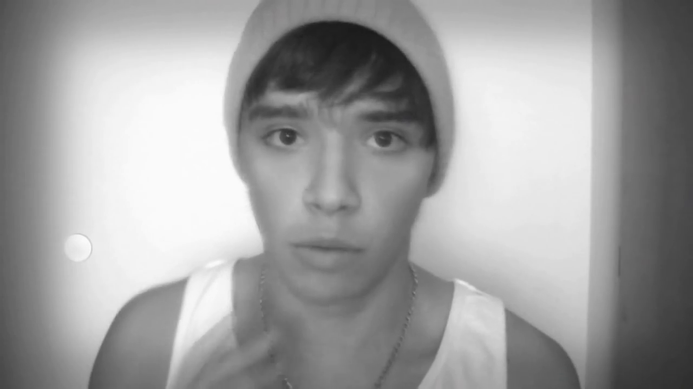{#fig-ppp}

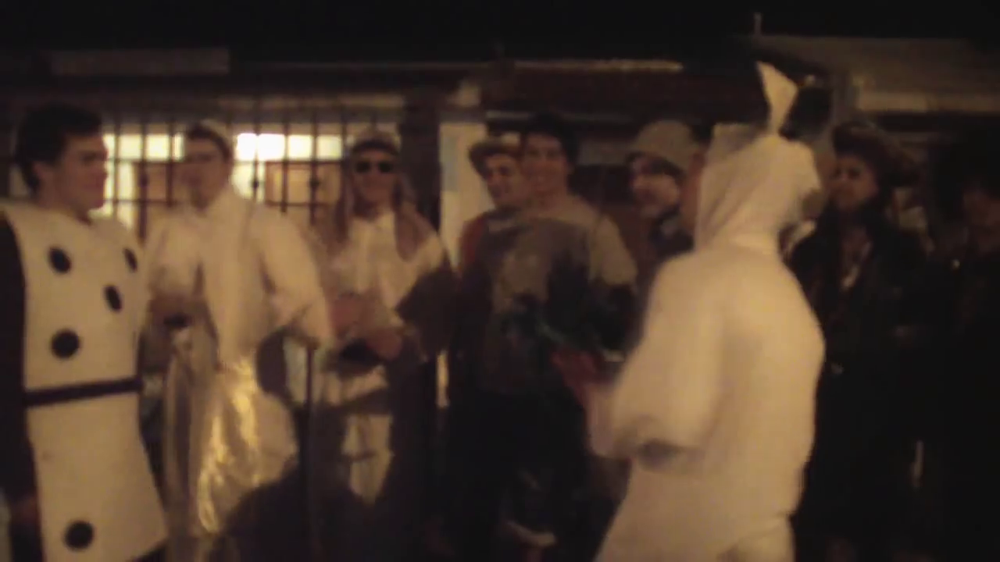{#fig-pg}

Contraste de planos: el uso estratégico del encuadre para modular la cercanía emocional (Julián Serrano).
:::

#### Vestimenta

La vestimenta, además de ser un elemento visual, es una marca de identidad. Predomina un estilo casual y cotidiano, lo que sugiere que los youtubers tratan de mostrarse auténticos a través de la elección de sus prendas. Se observan estilos específicos funcionales al video (disfraces, por ejemplo). Algunos usuarios emplean accesorios y joyas como parte de su identidad; otros aparecen sin remera: Julián Serrano, en particular, ha insistido en cómo esto constituye una marca de su identidad personal.

#### Gestos

Los gestos son una herramienta clave para transmitir emociones y mensajes, y se presentan de manera auténtica y espontánea. Predominan gestos posturales y kinésicos que acompañan las emociones descriptas en los videos. En segundo lugar aparecen los gestos con las manos, propios de la cultura argentina, que añaden un componente cultural y contextual a la comunicación. Se identifican como especialmente relevantes los "gestos funcionales": aquellos relacionados con la música, indiciales de los participantes, algunos de violencia o interacción, y los que acompañan o ejemplifican instancias puntuales de las narrativas. En varios casos se aprecia además una comunicación facial muy marcada, con posturas corporales atentas y gestos dirigidos hacia los participantes, indicando alta interacción visual en la dinámica de los videos.

### Gramática multimodal mínima del vlog

El vlog no "agrega" imagen y sonido a un texto preexistente: se compone como diseño en el sentido de la semiótica social de @kress2009, ampliada por @jewitt2009 y @cope2015. Cada modo aporta una porción del significado y el *ensamblaje* de modos produce efectos que ningún modo podría lograr por sí solo. Además, la plataforma no es un telón de fondo neutro: es un conjunto de elementos, interfaces y métricas que condicionan lo decible y lo visible [@vandijck2013; @vandijck2018; @scolari2018]. Decisiones aparentemente periféricas —el tipo de plano, el ritmo de montaje, la tipografía sobreimpresa, la música, los gestos, la miniatura, el llamado a la acción— son decisiones identitarias conscientes o inconscientes.

En términos analíticos, esta gramática mínima operacionaliza la pregunta por la identidad: cada recurso es legible como un movimiento enunciativo (presentar el yo, modular la emoción, convocar complicidad, negociar la visibilidad). El **primerísimo primer plano** instituye intimidad y autoridad autobiográfica; los **jump-cuts** exhiben la edición y, al hacerla visible, reafirman una sinceridad performativa; las **tipografías on-screen** funcionan como actos ilocutivos visuales (subrayar, ironizar, "gritar"); la **música** pauta la afectividad y organiza el tempo; los **escenarios domésticos** materializan el ; la **gestualidad** inscribe la extimidad en el cuerpo; y los **paratextos** fijan el .

| Recurso | Función identitaria | Señales/efectos | Ejemplo breve (corpus) |
|:--|:--|:--|:--|
| Plano (primerísimo/primer plano) | Intimidad y autoridad del yo | Rostro centrado, contacto ocular | Confesiones/emociones en close-up |
| Cámara en mano / walk-and-talk | Complicidad y dinamismo | Respiración/temblores leves, deícticos ("vení") | Recorridos por casa/calle mientras habla |
| Ritmo de edición / jump-cuts | Energía juvenil; transparencia del montaje | Cortes visibles para énfasis/ironía | Remates cómicos, aceleraciones |
| Tipografía on-screen / stickers | Ilocuciones visuales (subrayar, gritar, ironizar) | MAYÚSCULAS, emojis, rotulación | Resaltar punchline o dato clave |
| Música / FX | Puntuación afectiva; clima | Entradas/salidas; caídas para gag | Cambios de track en clímax/punch |
| Escenario (habitación/exterior) | Backstage de autenticidad / performance estética | Decorado personal; vistas urbanas | Dormitorio como "hábitat"; plazas/centros |
| Vestimenta / props | Marca de estilo y pertenencia | Outfit casual, accesorios, objetos fetiche | Gorras, camisetas, micrófonos visibles |
| Gestualidad / kinésica | Extimidad y humor | Exageración facial, manos enfáticas | Gritos simulados, caras, bailes |
| Paratextos (título/desc/) | Contrato de lectura y promesa de valor | Ganchos, caps lock, thumbnails expresivos | "NO LO PODÍA CREER 😱" |
| Llamados a la acción | Comunidad y métrica como legitimación | "Dale like", "Suscribite", "Comentá" | Al inicio/final; metas de comunidad |

: Gramática multimodal mínima del vlog (recurso → función → ejemplo). {#tbl-gramatica-multimodal}

Conviene subrayar tres puntos sobre cómo leer esta tabla. Primero, cada recurso es una opción de diseño cuyo sentido depende del ensamblaje: un primerísimo primer plano sostenido, con respiración audible y cámara en mano, orienta hacia un ethos confesional; el mismo plano estabilizado y musicalizado con un *track* festivo, hacia una performatividad lúdica. Segundo, los recursos son mecanismos de indexación identitaria: el walk-and-talk con deícticos espaciales ("vení", "mirá esto") sitúa al enunciador como guía de experiencia, mientras que el plano fijo en habitación con texto en pantalla coloca el énfasis en la verbalización del yo [@kress2009; @jewitt2009]. Tercero, los recursos están atravesados por regímenes de plataforma: los llamados a la acción y la serialidad se integran a la superestructura del vlog porque son, a la vez, exigencias del algoritmo y rituales de pertenencia [@vandijck2013].

Desde esta óptica, la extimidad deja de ser un rasgo moralmente ambiguo para leerse como protocolo observable del género: planos cortos del rostro, "descuidos" controlados (risas, errores mantenidos en edición), ruidos de habitación, menciones a la familia o amigos, y co-presencias que legitiman el yo narrado como yo en comunidad [@sibilia2008]. La autenticidad resulta de una pragmática de recursos que construyen verosimilitud y confianza en serie [@fairclough2003; @cope2015].

## Rasgos definitorios del videoblog como género ciberdiscursivo

El análisis desarrollado permite sintetizar los rasgos constitutivos del videoblog. Lejos de una lista de características, estos rasgos operan articuladamente, configurando un modo específico de producción y circulación discursiva que responde a las lógicas culturales y comunicativas de las juventudes contemporáneas.

**Hibridez constitutiva.** El vlog es constitutivamente híbrido en múltiples dimensiones. A nivel textual, el 76,25% de los vlogs combina dos o más tipos de secuencias en un mismo video: la hibridez no es accidental, sino necesaria para cumplir las funciones comunicativas del género. A nivel modal, articula oralidad y escritura, imagen y sonido, elementos editados y espontáneos; la multimodalidad no es acompañamiento, sino que construye significado. A nivel funcional, los vlogs operan simultáneamente informando (42,5%), expresando (38,75%) y apelando (6,25%), con un 12,5% que mantiene equilibrios funcionales.

**La lógica de la extimidad.** Siguiendo a @sibilia2008, el vlog opera bajo la lógica de la **extimidad**, entendida como la exhibición estratégica de la intimidad en espacios públicos. Mostrar lo íntimo genera autenticidad, reconocimiento y pertenencia comunitaria. La autenticidad se construye mediante la exhibición de lo que tradicionalmente se consideraba privado: el backstage goffmaniano se convierte en escenario principal. Los youtubers que muestran sus habitaciones desordenadas o que lloran frente a cámara no están "perdiendo privacidad" sino produciendo capital simbólico: autenticidad verificable.

**Construcción comunitaria.** El vlog no genera "audiencias" en el sentido clásico, sino **comunidades de práctica** con identidades colectivas muy marcadas. Estas comunidades se articulan mediante códigos comunes (referencias, bromas internas, formas particulares de hablar), rituales discursivos (saludos, despedidas, modos de interacción) y prácticas de participación (comentarios, fanarts, videos respuesta, memes). El 83,75% de los videos incluye denominaciones comunitarias, confirmando que construir pertenencia es un elemento constante del género.

**(Anti)Cortesía juvenil específica.** El vlog juvenil prioriza la familiaridad y la informalidad sobre la deferencia y el distanciamiento. El uso generalizado de coloquialismos, gestos informales y la exhibición de errores refuerzan la intimidad compartida antes que afectar negativamente la imagen pública. El índice de cercanía discursiva que propusimos evidencia cómo los youtubers adaptan sus formas de interacción según el contexto particular de cada video, lo que demuestra una competencia estratégica más allá de un rasgo fijo de personalidad.

**El vlog como espacio social practicado.** Recuperando la noción de @mayans2002, el vlog no es simplemente un formato textual o un producto audiovisual, sino un **espacio social practicado** por jóvenes que lo habitan, lo significan y lo transforman en escenario de sus narrativas vitales. Construye lugar, articula comunidades, es performativo en sentido amplio, responde a la lógica de la extimidad y opera desde una cortesía juvenil específica.

## Conclusiones parciales del capítulo

Este capítulo se propuso caracterizar el videoblog como género ciberdiscursivo, partiendo de la pregunta por las especificidades discursivas, comunitarias y pragmáticas que lo distinguen de otros formatos comunicativos en YouTube. El análisis empírico de 80 videoblogs argentinos (2012-2016) ha demostrado que el vlog no es un mero formato audiovisual, sino un género discursivo complejo, culturalmente situado y funcionalmente diverso.

Desde una perspectiva textual [@heinemann1991], evidenciamos que el vlog combina secuencias narrativas, argumentativas, descriptivas y dialogales en configuraciones híbridas. Desde una perspectiva comunitaria [@swales1990], demostramos que el vlog se inscribe en comunidades discursivas con propósitos, denominaciones identitarias y competencias específicas. Desde una perspectiva pragmática, mostramos que el vlog construye cercanía mediante estrategias de cortesía juvenil que difieren de los modelos adultos formales.

Los aportes de este capítulo se articulan en cuatro dimensiones complementarias. En el plano teórico, el trabajo desarrolla el concepto de contexto discursivo dominante como una alternativa matizada frente a la simple asignación de funciones, al mismo tiempo que propone el índice de cercanía discursiva para operacionalizar las estrategias de construcción de intimidad. Este andamiaje nos permite reconceptualizar el videoblog, entendiéndolo como un espacio social practicado antes que como un mero formato textual.

En la dimensión metodológica, el esfuerzo se centró en el análisis sistemático de un corpus extenso —compuesto por 80 videos y 155 variables— mediante la integración de enfoques cuantitativos y cualitativos. Este abordaje requirió el desarrollo de algoritmos de codificación orientados a nuevas categorizaciones, como la hibridez textual y la cercanía discursiva, y supuso la reivindicación de los elementos paratextuales como rasgos constitutivos del género.

Por su parte, los aportes empíricos radican en la caracterización exhaustiva del vlog argentino de este período, logrando cuantificar los patrones estructurales que resultan clave en estos discursos. Finalmente, estas vertientes confluyen en una dimensión aplicada, dado que los datos relevados proveen un contexto fundamental para comprender las lógicas de producción del contenido juvenil y permiten identificar rasgos genéricos que serán de gran utilidad para futuros análisis comparativos.

Quedan abiertas para el capítulo siguiente las preguntas sobre cómo operan las narrativas identitarias en vlogs con distintos contextos discursivos dominantes, qué repertorios identitarios circulan y se estabilizan en estos espacios, y cómo se articulan identidades individuales y comunitarias. El videoblog, caracterizado aquí como género ciberdiscursivo, se revela como un espacio privilegiado para comprender cómo las juventudes contemporáneas construyen sus identidades. Pasemos, entonces, del género a las identidades.
